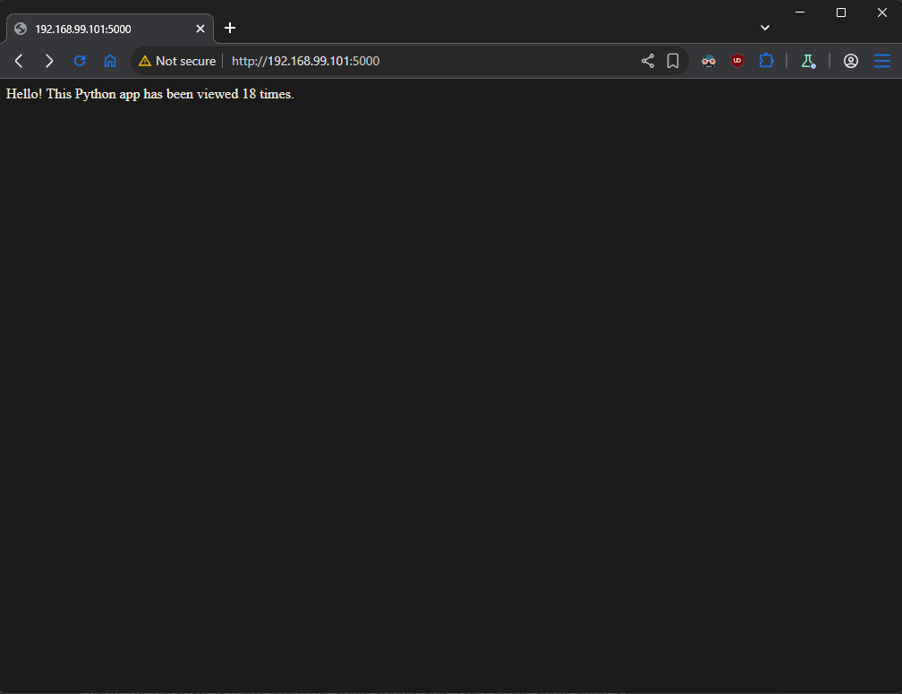

## Task

Prepare a set of **two virtual machines**. One of the virtual machines should host the application, and the other -- the database. Pick up one of the pairs -- **Python + Redis**, **Python + MariaDB**, **Go + Redis**, or **Go + MariaDB**. You could implement it by following the manual approach or by automating the solution to some extent, including by using **Vagrant**.

*Note that the application should be adjusted a bit to be able to communicate with the remote database*

## Solution

- **[Diagram](#diagram)**
- **[Technology Stack](#technology-stack)**
- **[Database VM Provisioning](#database-vm-provisioning-set_db)**
- **[Application VM Provisioning](#application-vm-provisioning-set_app)**
- **[Deploymnet](#deploymnet)**

### Diagram

```plain
------------+---------------------------+-------------
            |                           |
      192.168.99.101              192.168.99.102
            |                           |     
+-----------+-----------+   +-----------+-----------+
|  [ app.homework.lab ] |   |  [ db.homework.lab ]  |
|                       |   |                       |
|  ython3.13-venv       |   |  mariadb-server       |
|  python3-pip          |   |  mariadb-client       |
|                       |   |                       |
|                       |   |                       |
|                       |   |                       | 
|                       |   |                       |
+-----------------------+   +-----------+-----------+
```

### Technology Stack
- **Virtualization:** Vagrant + VirtualBox
- **Operating System:** Debian 13
- **Application:** Python 3.13 with virtual environment
- **Database:** MariaDB 11.8.3
- **Network:** Private network (192.168.99.0/24)
- **Automation:** Shell provisioning scripts

### Database VM Provisioning (`$set_db`)
The database provisioning script
```sh
$set_db = <<SCRIPT

# 1. Install MariaDB
sudo apt update
sudo apt install -y mariadb-server mariadb-client

# 2. Configure MariaDB to listen on all interfaces
sudo sed -i 's/^bind-address\s*=.*/bind-address = 0.0.0.0/' /etc/mysql/mariadb.conf.d/50-server.cnf

# 3. Ensure MariaDB service start up on boot
sudo systemctl start mariadb
sudo systemctl enable mariadb

# 4. Restart MariaDB to apply configuration
sudo systemctl restart mariadb

# 5. Create app user
sudo mysql -e "CREATE USER IF NOT EXISTS 'app_user'@'localhost' IDENTIFIED BY 'Parolka-12345';"
sudo mysql -e "CREATE USER IF NOT EXISTS 'app_user'@'%' IDENTIFIED BY 'Parolka-12345';"
sudo mysql -e "FLUSH PRIVILEGES;"

# 6. Initialize the database from db.sql
sudo mysql < /vagrant/db/db.sql

echo "MariaDB installed and database initialized!"

SCRIPT
```

- Installs MariaDB server and client packages
- Configures network access by modifying the MariaDB bind-address to 0.0.0.0, allowing remote connections from the application VM
- Creates database user app_user with password Parolka-12345, granting access from both localhost and remote hosts
- Initializes the database by executing the /vagrant/db/db.sql file, which creates the necessary schema and data.

### Application VM Provisioning (`$set_app`)
The application provisioning script:
```sh
$set_app = <<SCRIPT

# 1. Create folder inside VM
sudo mkdir -p /app
sudo chown vagrant:vagrant /app

# 2. Copy local app/ to /app
sudo cp -r /vagrant/app/* /app

# 3. Install Python prerequisites
sudo apt-get update
sudo apt-get install python3.13-venv python3-pip -y

# 4. Create virtenv
cd /app
python3 -m venv .venv

# 5. Acticvate virt enviroment
source .venv/bin/activate

# 6. Install requirements
pip3 install -r requirements.txt

# 7. Rename .env.dev to .env
mv env.example .env

# 8. Run app detached from terminal
nohup /app/.venv/bin/python3 /app/app.py > /app/app.log 2>&1 &

SCRIPT
```
- Application deployment by creating `/app` directory and copying application files from the synced `/vagrant/app` folder
- Python environment setup including installing Python 3.13, creating a virtual environment, and installing dependencies from `requirements.txt`
- Configuration by renaming `env.example` to `.env`, which should contain the remote database connection parameters (DB_HOST=192.168.99.102, DB_USER=app_user, etc.)
- Application startup using `nohup` to run the Python app in the background, with output logged to `/app/app.log`

### Deploymnet
Execute command:
```sh
vagrant up
```
The command automatically provision both VMs. The database VM provisions first to ensure the database is ready when the application starts. The Python application is configured to communicate with the remote database using the private network connection.



