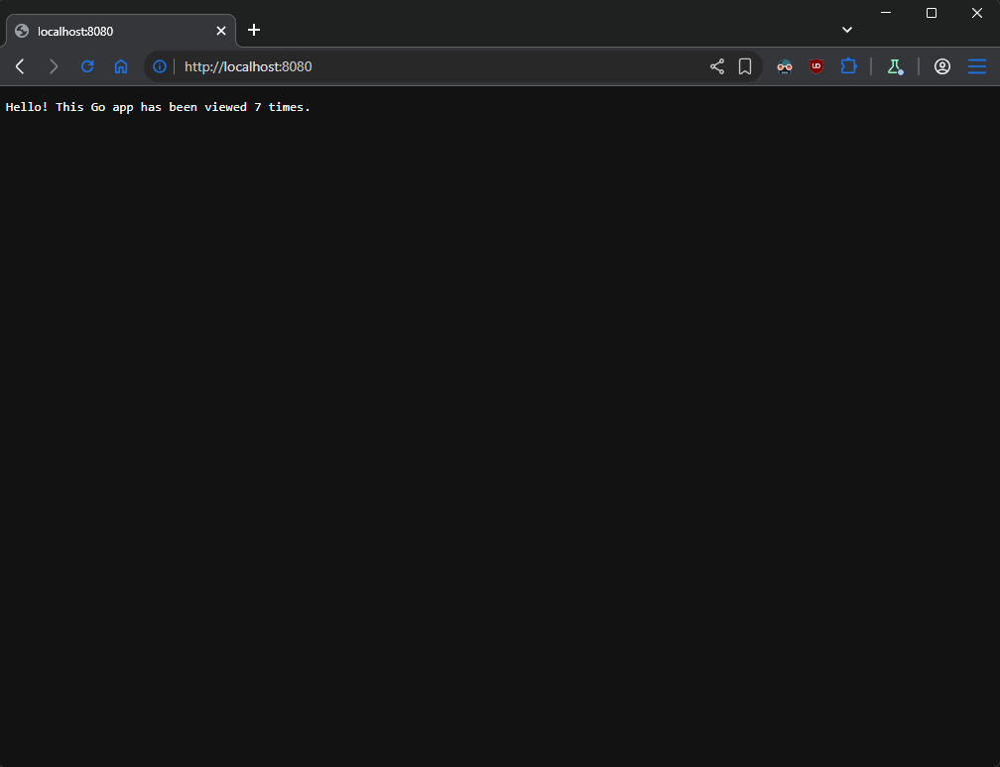

## Tasks

Prepare a set of two container images. One of the images should host the application, and the other – the database. Pick up one of the pairs – Python + Redis, Python + MariaDB, Go + Redis, or Go + MariaDB. Then spin up two containers out of them. You could implement it by following the manual approach or by automating the solution to some extent, including by using Vagrant.

*Note that the application should be adjusted a bit to be able to communicate with the remote database
Note that depending on the selection, one of the images could be a standard one (if using Redis)
Note that the Docker (or the container runtime/platform of choice) could be in a VM or on your host*

## Solution

- **[Diagram](#diagram)**
- **[Create Dockerfile for GO application](#create-dockerfile-for-go-application)**
- **[Create docker-compose file for app and db](#create-docker-compose-file-for-app-and-db)**
- **[Deployment](#deployment)**

---

### Diagram

```plain
+------------------------------------------------------------+
|                                                            |
|   docker runtime                                           |
|                                                            |
|         -------+------- app-network -------+----------     |
|                |                           |               |
|                |                           |               |
|    +-----------+-----------+   +-----------+-----------+   |
|    |      [ go-app ]       |   |      [ redis-db ]     |   |
|    |                       |   |                       |   |
|    |  Go                   |   |  Redis                |   |
|    |                       |   |                       |   |
|    |                       |   |                       |   |
|    |                       |   |                       |   |
|    |                       |   |                       |   |
|    |                       |   |                       |   |
|    +-----------------------+   +-----------+-----------+   |
|                                                            |
+------------------------------------------------------------+
```

### Create Dockerfile for GO application
This section defines a multi-stage build process to construct a lightweight and efficient container image. It first compiles the Go binary in a builder stage with all necessary dependencies, then copies only the final executable to a minimal Alpine Linux system to keep the production image small.

```dockerfile
# Use the official Golang image as the base
FROM golang:1.24-alpine AS builder

# Set environment variables
ENV CGO_ENABLED=0 \
    GOOS=linux \
    GOARCH=amd64

# Set working directory inside the container
WORKDIR /build

# Initialize and create a new go.mod file
RUN go mod init go-counter

# Copy the entire application source
COPY . .

# Download dependencies
RUN go mod tidy

# Build the Go binary
RUN go build -o app .

# Final lightweight stage
FROM alpine:3.21 AS final

# Copy the compiled binary from the builder stage
COPY --from=builder /build/app /bin/app

# Expose the application's port
EXPOSE 8000

# Run the application
CMD ["bin/app"]
```
Execute command:
```sh
docker build -t go-app:latest . 
```

### Create docker-compose file for app and db
This configuration file orchestrates the environment by defining the Go application and Redis database as interacting services. It creates a dedicated bridge network to allow the containers to communicate securely and maps the required ports so the application is accessible from the host machine.
```yml
services:
  go-app:
    container_name: go-app
    image: go-app
    ports:
      - "8080:8080"
    depends_on:
      - redis-db
    networks:
      - app-network

  redis-db:
    container_name: redis-db
    image: redis:latest
    ports:
      - '6379:6379'
    networks:
      - app-network

networks:
  app-network:
    driver: bridge
```
### Deployment
This step executes the Docker Compose command to build and launch the defined services in detached mode. By running this, both the application and database containers spin up in the background, establishing the full stack with a single command.
```sh
docker-compose up -d
```

