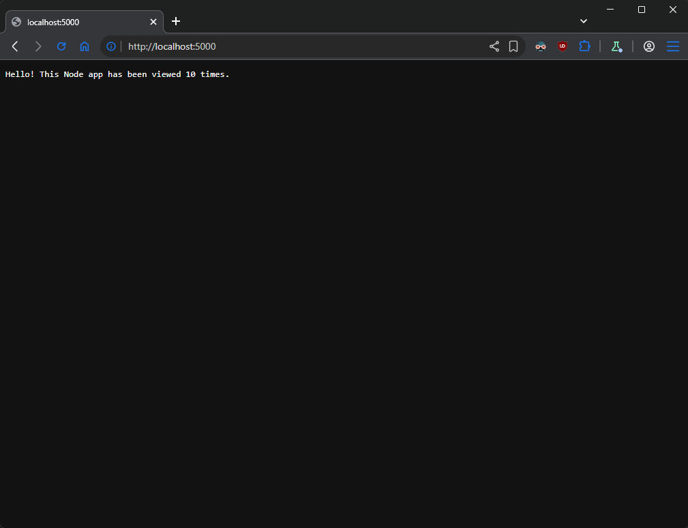

# Task
If **NodeJS** is your thing, try to create a version of the second **NodeJS** application but using **MariaDB** as a database. You are free to use either a pair of VMs, or a pair of containers (and container images).
*Note that the application should be adjusted a bit to be able to communicate with the remote database
Note that the Docker (or the container runtime/platform of choice) could be in a VM or on your host*.

## Solution

- **[Diagram](#diagram)**
- [NodeJS app](#nodejs-app)
- **[Create Dockerfile for GO application](#create-dockerfile-for-nodejs-application)**
- **[Create docker-compose file for app and db](#create-docker-compose-file-for-app-and-db)**
- **[Deployment](#deployment)**


### Diagram
```plain
+------------------------------------------------------------+
|                                                            |
|   docker runtime                                           |
|                                                            |
|         -------+------- app-network -------+----------     |
|                |                           |               |
|                |                           |               |
|    +-----------+-----------+   +-----------+-----------+   |
|    |    [ nodejs-app ]     |   |      [ maria-db ]     |   |
|    |                       |   |                       |   |
|    |  npm express          |   |  MariaDB              |   |
|    |  npm mariadb          |   |                       |   |
|    |                       |   |                       |   |
|    |                       |   |                       |   |
|    |                       |   |                       |   |
|    |                       |   |                       |   |
|    +-----------------------+   +-----------+-----------+   |
|                                                            |
+------------------------------------------------------------+
```
### NodeJS app
MariaDB uses a pool to efficiently manage multiple open connections (pool.getConnection()), which must be manually released (conn.release()) to prevent the app from hanging. Also requires a transactional approach: first INSERT a new row to record the visit, then SELECT COUNT(*) to calculate the total. The data persists as structured rows in a table (hits), providing a historical log (seen_at).
```js
const express = require('express');
const mariadb = require('mariadb');

const pool = mariadb.createPool({
  host: 'mariadb',
  user: 'app_user',
  password: 'Parolka-12345',
  port: 3306,
  database: 'counters',
  connectionLimit: 5 // Allow up to 5 simultaneous connections
});

const app = express();
const PORT = 5000;

app.get('/', async (req, res) => {
  let conn;
  try {
    // connect to pool
    conn = await pool.getConnection();

    // incremant the counter
    await conn.query("INSERT INTO hits (seen_at) VALUES (NOW())");

    // count the rows to see how many hits we have
    const rows = await conn.query("SELECT COUNT(*) as total FROM hits");

    // convert array of objects to string
    const count = rows[0].total.toString();

    // show message
    const msg = `Hello! This Node app has been viewed ${count} times.\n`;
    res.type('text/plain').send(msg);

  } catch (err) {
    // log the error / HTML code 500 (Database error)
    console.error('Error handling request:', err);
    res.status(500).send('Database Error');
  } finally {
    // releas the connection
    if (conn) conn.release();
  }
});

app.listen(PORT, '0.0.0.0', () => {
  console.log(`Server listening on http://0.0.0.0:${PORT}`);
});
```

### Create Dockerfile for NodeJS application
This section defines a build process to construct a lightweight and efficient container image. It's installing all necessary dependencies, then copies `app.js` and run the application on port 5000.
```Dockerfile
FROM node:22

# Set workdir
WORKDIR /app

# Install the required packages
RUN npm install express mariadb

# Copy all filse to workdir
COPY . .

EXPOSE 5000

# Run the application
CMD ["node", "app.js"]
```

Execute command:
```sh
docker build -t nodejs-app:latest .
```

### Create docker-compose file for app and db
This configuration file orchestrates the environment by defining the NodeJS application and MariaDB database as interacting services. Key moment is to map `db.sql` to `/docker-entrypoint-initdb.d/init.sql` inside container and MariaDB will runs files in this folder alphabetically on first startup.
```yml
services:
  mariadb:
    image: mariadb:latest
    container_name: mariadb
    environment:
      MARIADB_USER: app_user
      MARIADB_PASSWORD: Parolka-12345
      MARIADB_DATABASE: counters
      MARIADB_ALLOW_EMPTY_ROOT_PASSWORD: 'yes'
    volumes:
      - mariadb_data:/var/lib/mysql
      - ./db/db.sql:/docker-entrypoint-initdb.d/init.sql
    ports:
      - "3307:3306"

  nodejs-app:
    image: nodejs-app
    ports: 
      - "5000:5000"
    depends_on:
      - mariadb

volumes:
  mariadb_data:
```

### Deployment
This step executes the Docker Compose command to build and launch the defined services in detached mode. By running this, both the application and database containers spin up in the background, establishing the full stack with a single command.
```sh
docker-compose up -d
```
