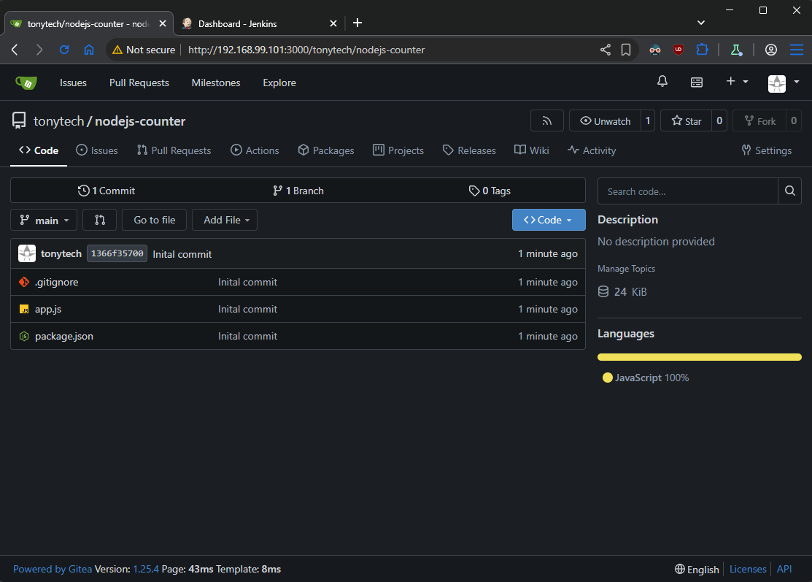
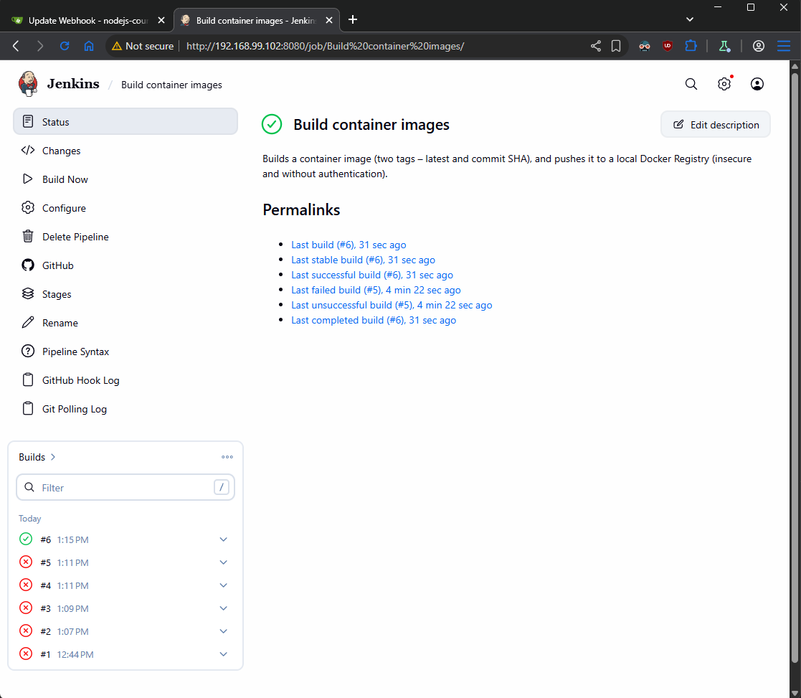

## Task

Create a **CI pipeline** using **Jenkins** for a **NodeJS** application (in the supporting files) that **checks out** the code from **Gitea** repository, **builds** a container image (two tags -- **latest** and **commit SHA**), and **pushes** it to a local **Docker Registry** (insecure and without authentication)

## Solution

- **[Diagram](#diagram)**
- **[Create simple Dockerfile for NodeJS app](#create-simple-dockerfile-for-nodejs-app)**
- **[Create Jenkinsfile](#create-jenkinsfile)**
- **[Copy ssh key for jenkins user (login on jenkins.homework.lab)](#copy-ssh-key-for-jenkins-user-login-on-jenkinshomeworklab)**
- **[Create repository in Gitea and push the codebase](#create-repository-in-gitea-and-push-the-codebase)**
- **[Create CI pipeline in Jenkins](#create-ci-pipeline-in-jenkins)**

### Diagram

```plain
------------+---------------------------+------------
            |                           |
      192.168.99.101              192.168.99.102
            |                           |
+-----------+-----------+   +-----------+-----------+
|       [ docker ]      |   |      [ jenkins ]      |
|                       |   |                       |
|  docker               |   |  jenkins              |
|  gitea                |   |                       |
|  docker registry      |   |                       |
|  git                  |   |                       |
|  nodejs app           |   |                       |
|                       |   |                       |
+-----------------------+   +-----------+-----------+
```

### Create simple Dockerfile for NodeJS app

This Dockerfile will be used by Jenkins for creation of images

```Dockerfile
FROM node:18-alpine

WORKDIR /app

COPY package*.json ./

RUN npm install --production

COPY . .

EXPOSE 5000

CMD ["node", "app.js"]
```

### Create Jenkinsfile

```groovy
pipeline {
    agent any

    environment {
        REGISTRY = '192.168.99.101:5000'
        IMAGE_NAME = 'nodejs-counter'
    }

    stages {
        stage('Build') {
            steps {
                script {
                    SHORT_SHA = env.GIT_COMMIT.take(10)
                    docker.build("${REGISTRY}/${IMAGE_NAME}:${SHORT_SHA}")
                    docker.build("${REGISTRY}/${IMAGE_NAME}:latest")
                }
            }
        }

        stage('Push') {
            steps {
                script {
                    SHORT_SHA = env.GIT_COMMIT.take(10)
                    docker.image("${REGISTRY}/${IMAGE_NAME}:${SHORT_SHA}").push()
                    docker.image("${REGISTRY}/${IMAGE_NAME}:latest").push()
                }
            }
        }
    }
}
```

### Copy ssh key for jenkins user (login on jenkins.homework.lab)

```sh
# Copy to jenkins.homework.lab
sudo -u jenkins ssh-copy-id -i /var/lib/jenkins/.ssh/id_rsa.pub jenkins@jenkins.homework.lab

# Copy to docker.homework.lab
sudo -u jenkins ssh-copy-id -i /var/lib/jenkins/.ssh/id_rsa.pub jenkins@docker.homework.lab
```

### Create repository in Gitea and push the codebase

- Open gitea at http://192.168.99.101:3000/ and create new repository from + with name `nodejs-counter`

- Login on docker.homework.lab and push the existing local repository to Gitea instance.

```sh
# Add files
cd /nodejs-counter
git add .
git commit -m "Initial commit"

# Add the remote you want to push to
git remote add origin http://192.168.99.101:3000/tonytech/nodejs-counter.git

# push to the remote
git push -u origin main
```



- Set webhook on Gitea app repository

Settings -> Webhooks -> Add Webhook -> Gitea -> set Target URL: http://192.168.99.102:8080/gitea-webhook/post -> Save

### Setup Jenkins

1. **Credentials**

**Settings** -> **Credentials** -> **System** -> **Global credentials (unrestricted)** -> **adding some credentials**

- Create New credentials of kind "Username and password"

```plain
username: jenkins
password: Parolka-12345
ID: jenkins-password
Description: Local user password identification
```

- Create New credentials of kind "SSH Username with private key"

```plain
ID: jenkins-ssh-key
Description: SSH private key identification
username: jenkins
Enter directly - select
Key -> paste the ssh
```

2. **Install Gitea and Docker plugins**

**Settings** -> **Plugins** -> **Available plugins** -> **Install**

- Gitea
- Docker Pipeline
- Docker

3. **Setup Gitea servers**

**Settings** -> **System** -> **Gitea servers** -> **add Gitea server (http://192.168.99.101:3000/)** -> **Save**

4. Add Jenkins agent

Settings -> Nodes -> set name and set "Permanent" -> Set "Number of executors" based on resources (parallel executions) -> Set "Remote root directory" on docker.homework.lab for jenkins user (in our case /home/jenkins) -> Set "Labels" (for example "docker") -> Set "Launch method" to "Launch agents via SSH" and select credentials -> Save

5. Remove Build-in node

Settings -> Nodes -> Built-In Node -> Configure -> Set "Number of executors" to 0 -> Save

### Create Jenkins pipeline

New Item -> Set name and selectr "Pipeline" -> Set "GitHub project" -> paste project url -> Select "GitHub hook trigger for GITScm polling" and "Poll SCM" -> Pipeline (Definition -> Pipeline script from SCM) -> SCM set to "Git" -> change branch to "\*/main"

### Test automated execution of CI pipeline

- Create README.md file locally and push to origin



### Check Docker Registry

- List all repositories in the registry

```sh
curl http://192.168.99.101:5000/v2/_catalog

# OUTPUT
{"repositories":["nodejs-counter"]}
```

- List all tags for nodejs-counter image

```sh
curl http://192.168.99.101:5000/v2/nodejs-counter/tags/list

# OUTPUT
{"name":"nodejs-counter","tags":["latest","1ab2a5bf95"]}
```
