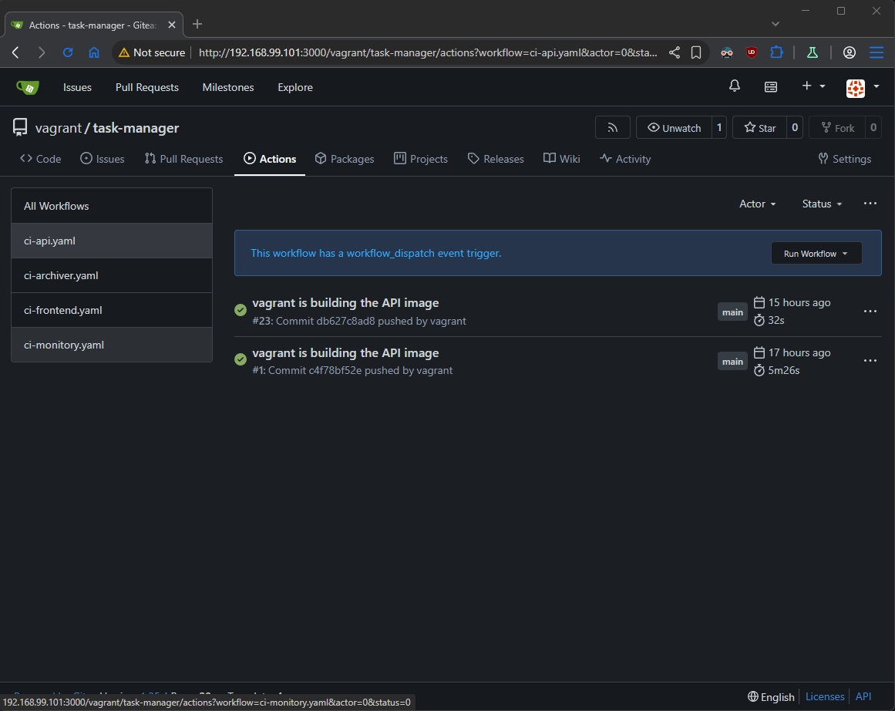
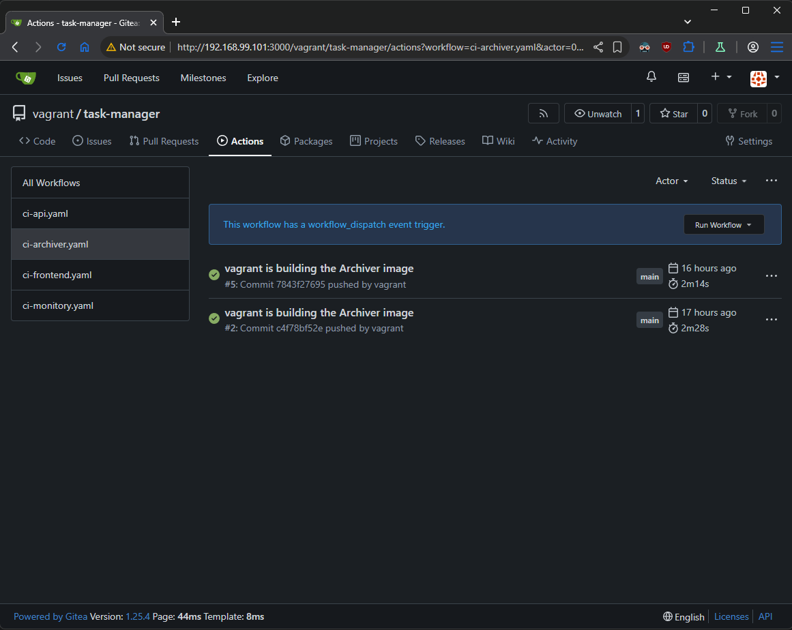
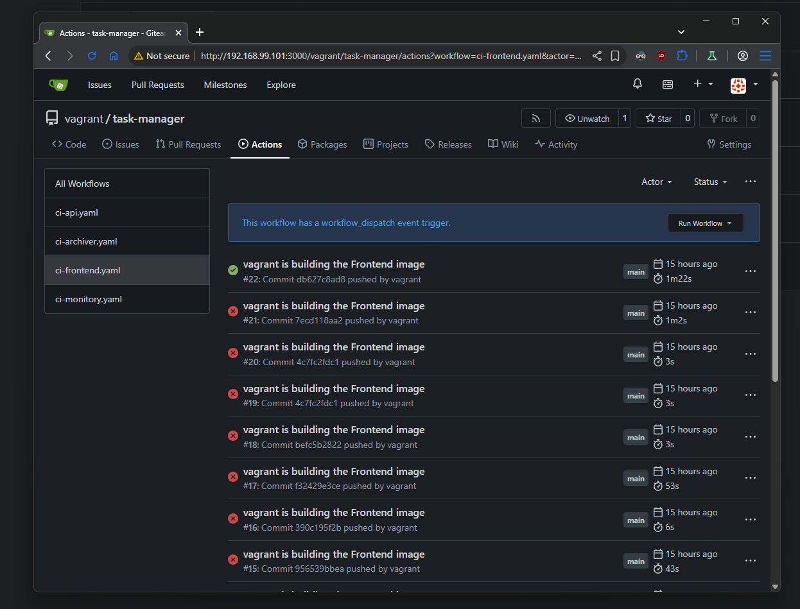
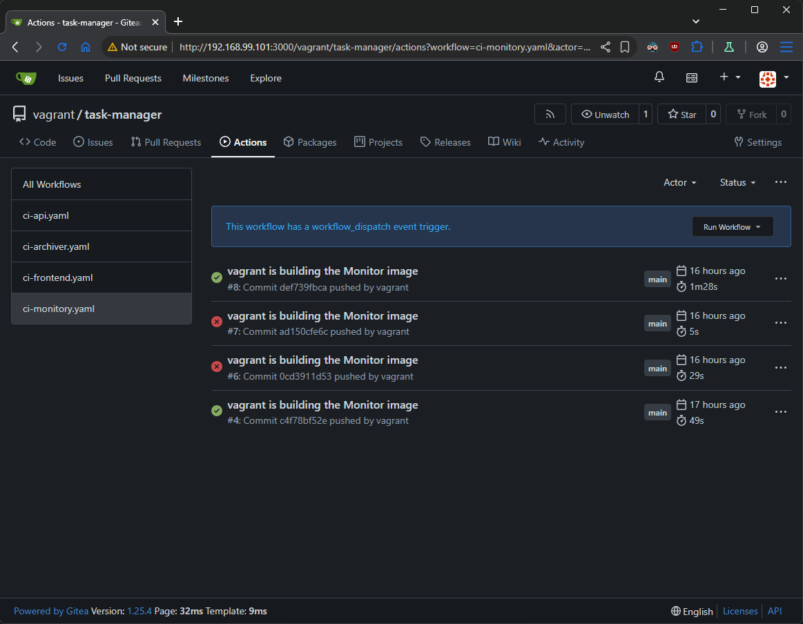

## Task

Try to implement as many of the remaining tests as possible to the respective **Gitea** pipeline

## Solution

- **[Diagram](#diagram)**
- **[Prepare bash script to run all service cotainers](#prepare-bash-script-to-run-all-service-cotainers)**
- **[Python CI pipeline](#python-ci-pipeline)**
- **[Java CI pipeline](#java-ci-pipeline)**
- **[HTML/JavaScript CI pipeline](#htmljavascript-ci-pipeline)**
- **[Go CI pipeline](#go-ci-pipeline)**


### Diagram

```plain
------------+-------------
            |
      192.168.99.101      
            |
+-----------+-----------+
|       [ docker ]      |
|                       |
|  docker               |
|  gitea                |
|  docker registry      | 
|  git                  | 
|                       | 
|                       | 
+-----------------------+ 
```

### Prepare bash script to run all service cotainers
```sh
#!/usr/bin/env bash
set -e

docker rm -f api redis-db monitor frontend archiver 2>/dev/null || true

echo "* Create the custom dedicated network ..."
docker network create task-net || true

echo "* Starting Task Manager API container ..."
docker run -d \
  --name api \
  -p 5001:5000 \
  --net task-net \
  localhost:5000/task-manager-api:latest

echo "* Starting Task Manager Redis container ..."
docker run -d \
  --name redis-db \
  -p 6379:6379 \
  --net task-net \
  redis

echo "* Starting Task Manager Monitor container ..."
docker run -d \
  --name monitor \
  -p 5002:8080 \
  --net task-net \
  localhost:5000/task-manager-monitor:latest

echo "* Starting Task Manager Frontend container ..."
docker run -d \
  --name frontend \
  -p 80:80 \
  --net task-net \
  localhost:5000/task-manager-frontend:latest

echo "* Starting Task Manager Archiver container ..."
docker run -d \
  --name archiver \
  --net task-net \
  -e REDIS_HOST=redis-db \
  localhost:5000/task-manager-archiver:latest
```
### Python CI pipeline
```yml
env:
  DOCKER_REGISTRY_URL: 192.168.99.101:5000
  DOCKER_IMAGE_NAME: task-manager-api

name: Python API test and build image
run-name: ${{ gitea.actor }} is building the API image
on:
  push:
    branches: [main]
    paths:
      - 'services/api/**' # The whole pipeline only runs if this folder changes
  workflow_dispatch:

jobs:
  test:
    runs-on: ubuntu-latest
    steps:
      - name: Checkout code
        uses: actions/checkout@v6

      - name: Set up Python
        uses: actions/setup-python@v4
        with:
          python-version: '3.12'

      - name: Install dependencies
        run: |
          cd services/api
          pip install pytest redis flask

      - name: Run Unit Tests
        run: |
          cd services/api
          python3 -m pytest tests/test_app.py

  build-images:
    needs: test
    runs-on: ubuntu-latest
    steps:
      - name: Checkout Code
        uses: actions/checkout@v6

      - name: Set up Docker Buildx
        uses: docker/setup-buildx-action@v3
        with:
          buildkitd-config-inline: |
            [registry."192.168.99.101:5000"]
              http = true
              insecure = true

      - name: Extract metadata (tags, labels) for Docker
        id: meta
        uses: docker/metadata-action@v5
        with:
          images: ${{ env.DOCKER_REGISTRY_URL }}/${{ env.DOCKER_IMAGE_NAME }}
          tags: |
            type=sha,enable=true,priority=100,prefix=,suffix=,format=short
            type=raw,value=latest,enable={{is_default_branch}}
        env:
          DOCKER_METADATA_SHORT_SHA_LENGTH: 10

      - name: Build and push Docker image
        id: push
        uses: docker/build-push-action@v6
        with:
          platforms: linux/amd64
          context: ./services/api
          file: ./services/api/Dockerfile
          provenance: mode=max
          sbom: true
          push: true
          tags: |
            ${{ steps.meta.outputs.tags }}
          labels: ${{ steps.meta.outputs.labels }}
```
- List tags for a Task Manager API
```sh
$ curl http://localhost:5000/v2/task-manager-api/tags/list
{"name":"task-manager-api","tags":["db627c8ad8","latest","c4f78bf52e"]}
```



### Java CI pipeline
```yml
env:
  DOCKER_REGISTRY_URL: 192.168.99.101:5000
  DOCKER_IMAGE_NAME: task-manager-archiver

name: Java Archiver test and build
run-name: ${{ gitea.actor }} is building the Archiver image
on:
  push:
    branches: [main]
    paths:
      - 'services/archiver/**' # The whole pipeline only runs if this folder changes
  workflow_dispatch:

jobs:
  test:
    runs-on: ubuntu-latest
    steps:
      - name: Checkout code
        uses: actions/checkout@v6

      - name: Set up Java
        uses: actions/setup-java@v5
        with:
          distribution: 'temurin'
          java-version: '21'
          check-latest: true

      - name: Run Unit Tests
        run: |
          cd services/archiver
          ./mvnw test

  build-images:
    needs: test
    runs-on: ubuntu-latest
    steps:
      - name: Checkout Code
        uses: actions/checkout@v6

      - name: Set up Docker Buildx
        uses: docker/setup-buildx-action@v3
        with:
          buildkitd-config-inline: |
            [registry."192.168.99.101:5000"]
              http = true
              insecure = true

      - name: Extract metadata (tags, labels) for Docker
        id: meta
        uses: docker/metadata-action@v5
        with:
          images: ${{ env.DOCKER_REGISTRY_URL }}/${{ env.DOCKER_IMAGE_NAME }}
          tags: |
            type=sha,enable=true,priority=100,prefix=,suffix=,format=short
            type=raw,value=latest,enable={{is_default_branch}}
        env:
          DOCKER_METADATA_SHORT_SHA_LENGTH: 10

      - name: Build and push Docker image
        id: push
        uses: docker/build-push-action@v6
        with:
          platforms: linux/amd64
          context: ./services/archiver
          file: ./services/archiver/Dockerfile
          provenance: mode=max
          sbom: true
          push: true
          tags: |
            ${{ steps.meta.outputs.tags }}
          labels: ${{ steps.meta.outputs.labels }}
```
- List tags for a Task Manager Archiver
```sh
curl http://localhost:5000/v2/task-manager-archiver/tags/list
{"name":"task-manager-archiver","tags":["7843f27695","latest","c4f78bf52e"]}
```



### HTML/JavaScript CI pipeline

Before executing  **HTML/JavaScript CI pipeline** all containers should be runnned via [`start_services.sh`](#prepare-bash-script-to-run-all-service-cotainers)

```yml
env:
  DOCKER_REGISTRY_URL: 192.168.99.101:5000
  DOCKER_IMAGE_NAME: task-manager-frontend

name: HTML/JS Frontend test and build image
run-name: ${{ gitea.actor }} is building the Frontend image
on:
  push:
    branches: [main]
    paths:
      - 'services/frontend/**' # The whole pipeline only runs if this folder changes
  workflow_dispatch:

jobs:
  test-e2e:
    runs-on: ubuntu-latest
    steps:
    - name: Checkout code
      uses: actions/checkout@v6

    - name: Run End-To-End tests
      run: |
        cd services/frontend/tests
        ./smoke_test.sh

  test-pw:
    needs: test-e2e
    runs-on: ubuntu-latest
    steps:
    - name: Checkout code
      uses: actions/checkout@v6
    
    - name: Set up Node
      uses: actions/setup-node@v5
      with:
        node-version: lts/*

    - name: Install dependencies
      run: |
        cd services/frontend/tests
        npm ci

    - name: Install Playwright Browsers
      run: npx playwright install --with-deps chromium

    - name: Run Playwright tests
      run: |
        cd services/frontend/tests
        npx playwright test test_ui.spec.js

  build:
    needs: test-pw
    runs-on: ubuntu-latest
    steps:
      - name: Checkout Code
        uses: actions/checkout@v4

      - name: Set up Docker Buildx
        uses: docker/setup-buildx-action@v3
        with:
          buildkitd-config-inline: |
            [registry."192.168.99.101:5000"]
              http = true
              insecure = true

      - name: Extract metadata (tags, labels) for Docker
        id: meta
        uses: docker/metadata-action@v5
        with:
          images: ${{ env.DOCKER_REGISTRY_URL }}/${{ env.DOCKER_IMAGE_NAME }}
          tags: |
            type=sha,enable=true,priority=100,prefix=,suffix=,format=short
            type=raw,value=latest,enable={{is_default_branch}}
        env:
          DOCKER_METADATA_SHORT_SHA_LENGTH: 10

      - name: Build and push Docker image
        id: push
        uses: docker/build-push-action@v6
        with:
          platforms: linux/amd64
          context: ./services/frontend
          file: ./services/frontend/Dockerfile
          provenance: mode=max
          sbom: true
          push: true
          tags: |
            ${{ steps.meta.outputs.tags }}
          labels: ${{ steps.meta.outputs.labels }}
```
- List tags for a Task Manager Frontend
```sh
$ curl http://localhost:5000/v2/task-manager-frontend/tags/list
{"name":"task-manager-frontend","tags":["db627c8ad8","36e9aa3de4","3c22b12872","latest","ba8346ce9e","c4f78bf52e"]}
```



### Go CI pipeline

```yml
env:
  DOCKER_REGISTRY_URL: 192.168.99.101:5000
  DOCKER_IMAGE_NAME: task-manager-monitor

name: Go Monitor test and build image
run-name: ${{ gitea.actor }} is building the Monitor image
on:
  push:
    branches: [main]
    paths:
      - 'services/monitor/**' # The whole pipeline only runs if this folder changes
  workflow_dispatch:

jobs:
  test:
    runs-on: ubuntu-latest
    steps:
      - name: Checkout code
        uses: actions/checkout@v6

      - name: Set up Go
        uses: actions/setup-go@v6
        with:
          go-version: '1.21'

      - name: Install dependencies
        run: |
          cd services/monitor
          go mod tidy

      - name: Run Unit Tests
        run: |
          cd services/monitor
          go test -v ./...

  build:
    needs: test
    runs-on: ubuntu-latest
    steps:
      - name: Checkout Code
        uses: actions/checkout@v4

      - name: Set up Docker Buildx
        uses: docker/setup-buildx-action@v3
        with:
          buildkitd-config-inline: |
            [registry."192.168.99.101:5000"]
              http = true
              insecure = true

      - name: Extract metadata (tags, labels) for Docker
        id: meta
        uses: docker/metadata-action@v5
        with:
          images: ${{ env.DOCKER_REGISTRY_URL }}/${{ env.DOCKER_IMAGE_NAME }}
          tags: |
            type=sha,enable=true,priority=100,prefix=,suffix=,format=short
            type=raw,value=latest,enable={{is_default_branch}}
        env:
          DOCKER_METADATA_SHORT_SHA_LENGTH: 10

      - name: Build and push Docker image
        id: push
        uses: docker/build-push-action@v6
        with:
          platforms: linux/amd64
          context: ./services/monitor
          file: ./services/monitor/Dockerfile
          provenance: mode=max
          sbom: true
          push: true
          tags: |
            ${{ steps.meta.outputs.tags }}
          labels: ${{ steps.meta.outputs.labels }}
```

- List tags for a Task Manager Monitor
```sh
$ curl http://localhost:5000/v2/task-manager-monitor/tags/list
{"name":"task-manager-monitor","tags":["def739fbca","latest","c4f78bf52e"]}
```



### Docker and Local Docker registry
- List all Docker containers
```sh
$ docker ps
CONTAINER ID   IMAGE                                         COMMAND                  CREATED        STATUS        PORTS                                                                                NAMES
87baad17cb55   localhost:5000/task-manager-archiver:latest   "java -jar app.jar"      16 hours ago   Up 16 hours                                                                                        archiver
2cb66079909a   localhost:5000/task-manager-frontend:latest   "/docker-entrypoint.…"   16 hours ago   Up 16 hours   0.0.0.0:80->80/tcp, [::]:80->80/tcp                                                  frontend
1b9de9b41b95   localhost:5000/task-manager-monitor:latest    "./monitor"              16 hours ago   Up 16 hours   0.0.0.0:5002->8080/tcp, [::]:5002->8080/tcp                                          monitor
cda4d3f03e15   redis                                         "docker-entrypoint.s…"   16 hours ago   Up 16 hours   0.0.0.0:6379->6379/tcp, [::]:6379->6379/tcp                                          redis-db
8b418201ad76   localhost:5000/task-manager-api:latest        "python app.py"          16 hours ago   Up 16 hours   0.0.0.0:5001->5000/tcp, [::]:5001->5000/tcp                                          api
fa51146f4ed1   gitea/act_runner:latest                       "/sbin/tini -- run.sh"   18 hours ago   Up 18 hours                                                                                        gitea-runner-1
2955e570bb8d   docker.gitea.com/gitea:1.25.4                 "/usr/bin/entrypoint…"   18 hours ago   Up 18 hours   0.0.0.0:3000->3000/tcp, [::]:3000->3000/tcp, 0.0.0.0:222->22/tcp, [::]:222->22/tcp   gitea
81b69cee2154   mysql:8                                       "docker-entrypoint.s…"   18 hours ago   Up 18 hours   3306/tcp, 33060/tcp                                                                  gitea-db-1
8de2b247a1c5   registry:2                                    "/entrypoint.sh /etc…"   18 hours ago   Up 18 hours   0.0.0.0:5000->5000/tcp, [::]:5000->5000/tcp                                          registry
```

- List all repositories (image names)
```sh
$ curl http://localhost:5000/v2/_catalog
{"repositories":["task-manager-api","task-manager-archiver","task-manager-frontend","task-manager-monitor"]}
```