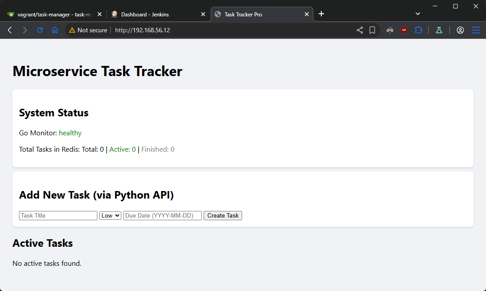

## Task

Come up with a fully (all tags) parametrized version of the **docker-compose.yaml** file in **part 1**

## Solution

- **[Diagram](#diagram)**


### Diagram

```plain
------------+-------------
            |
      192.168.56.12      
            |
+-----------+-----------+
|       [ docker ]      |
|                       |
|  docker               |
|  gitea                |
|  docker registry      | 
|  git                  | 
|                       | 
|                       | 
+-----------------------+ 
```


### Solution
- Clone gitea repository on docker host
```sh
git clone http://192.168.56.12:3000/vagrant/task-manager.git
```
- Check current tag and write it down for evironment file.
```sh
curl http://192.168.56.12:5000/v2/task-manager-monitor/tags/list
{"name":"task-manager-monitor","tags":["4eddbb81e2","latest"]}
```

- create docker-compose.yaml in root of repository
```yaml
services:
  redis:
    image: redis:8.4.0-alpine
    container_name: ${PROJECT_NAME}-redis
    networks:
      - task-manager-network

  api:
    image: ${REGISTRY_URL}/task-manager-api:${DEPLOYMNET_TAG:-latest}
    container_name: ${PROJECT_NAME}-api
    environment:
      - REDIS_HOST=redis
    depends_on:
      - redis
    networks:
      - task-manager-network

  monitor:
    image: ${REGISTRY_URL}/task-manager-monitor:${DEPLOYMNET_TAG:-latest}
    container_name: ${PROJECT_NAME}-monitor
    environment:
      - REDIS_HOST=redis
    depends_on:
      - redis
    networks:
      - task-manager-network

  frontend:
    image: ${REGISTRY_URL}/task-manager-frontend:${DEPLOYMNET_TAG:-latest}
    container_name: ${PROJECT_NAME}-frontend
    ports:
      - "${FRONTEND_PORT:-80}:80"
    depends_on:
      - redis
      - monitor
    networks:
      - task-manager-network

  archiver:
    image: ${REGISTRY_URL}/task-manager-archiver:${DEPLOYMNET_TAG:-latest}
    container_name: ${PROJECT_NAME}-archiver
    environment:
      - REDIS_HOST=redis
    depends_on:
      - redis
    networks:
      - task-manager-network

networks:
  task-manager-network:
    driver: bridge
```
- Create .env file for enviroment variables. For deployment tag use tag taken from above.
```plain
REGISTRY_URL=192.168.56.12:5000
PROJECT_NAME=task-manager
FRONTEND_PORT=80
DEPLOYMNET_TAG=4eddbb81e2
```
- Start all services
```sh
docker compose up -d
```

