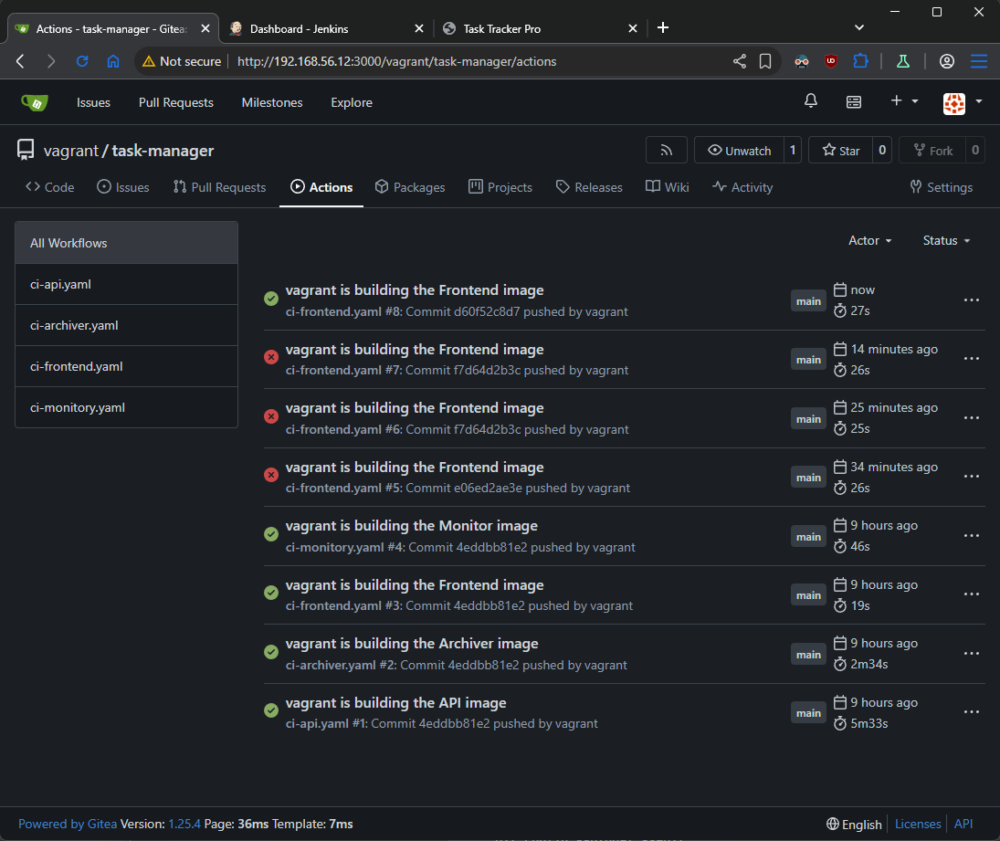

## Task

Add deployment job to the rest of the **Gitea** pipelines from **part 1**

## Solution

- **[Diagram](#diagram)**
- **[API](#api)**
- **[Archiver](#archiver)**
- **[Frontend](#frontend)**
- **[Monitor](#monitor)**


### Diagram

```plain
------------+-------------
            |
      192.168.56.12      
            |
+-----------+-----------+
|       [ docker ]      |
|                       |
|  docker               |
|  gitea                |
|  docker registry      | 
|  git                  | 
|                       | 
|                       | 
+-----------------------+ 
```

### API


### Archiver


### Frontend

- add deploymnt job and add monitoring of workflow itself in paths to trigger start of action
```yaml
# ... rest of code

    paths:
      - '.gitea/workflows/ci-frontend.yaml' # add this line
      - 'services/frontend/**'

# ... add deploymnet job

  deploy-service:
    runs-on: ubuntu-latest
    needs: build-images

    steps:
      - name: Checkout Code
        uses: actions/checkout@v4

      - name: Deploy Docker Compose
        run: |
          hash=${{env.GITHUB_SHA}}
          export FRONTEND_TAG=${hash::10}
          echo "Using tag $FRONTEND_TAG"
          docker compose up -d --no-deps frontend
``` 


### Monitor