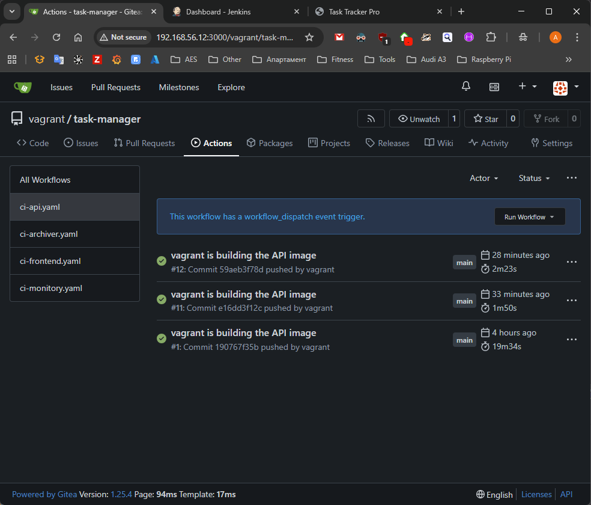
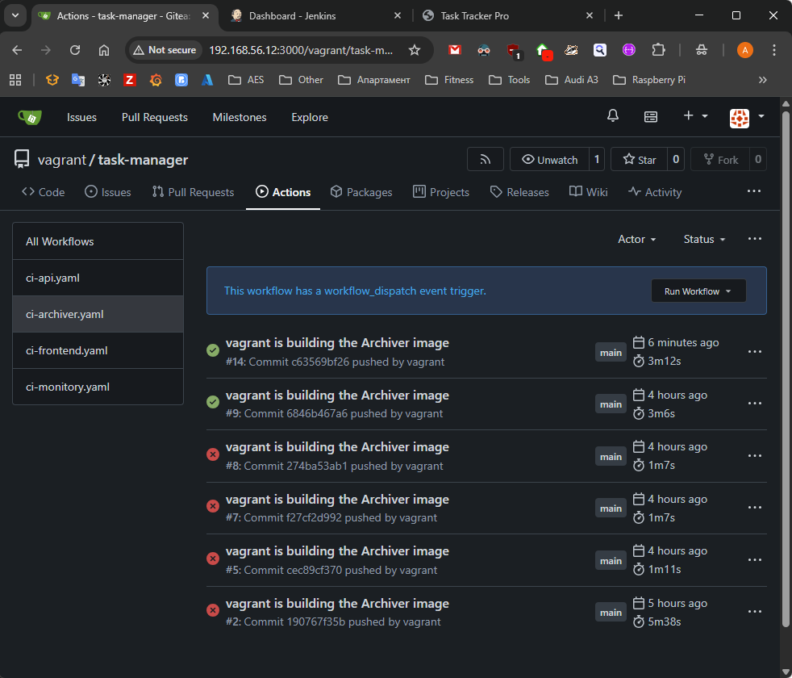
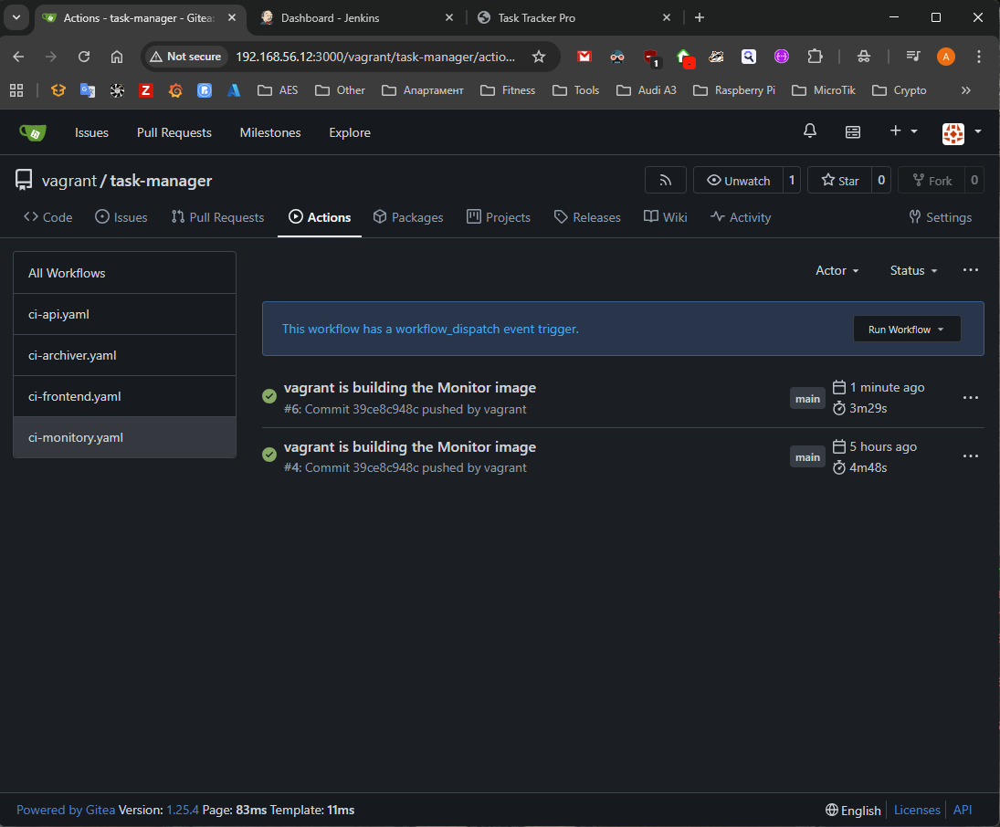

## Task

Add deployment job to the rest of the **Gitea** pipelines from **part 1**

## Solution

- **[Diagram](#diagram)**
- **[API](#api)**
- **[Archiver](#archiver)**
- **[Frontend](#frontend)**
- **[Monitor](#monitor)**

### Diagram

```plain
------------+-------------
            |
      192.168.56.12
            |
+-----------+-----------+
|       [ docker ]      |
|                       |
|  docker               |
|  gitea                |
|  docker registry      |
|  git                  |
|                       |
|                       |
+-----------------------+
```

### API

Add deployment job and new line workflow to monitor also itself, this will trigger the action if there is a change in `.gitea/workflows/ci-api.yaml`

```yaml
# ... rest of code
    paths:
      - '.gitea/workflows/ci-api.yaml' # add this line
      - 'services/api/**'

# ... add deployment job
  deploy-service:
    runs-on: ubuntu-latest
    needs: build-images

    steps:
      - name: Checkout Code
        uses: actions/checkout@v4

      - name: Deploy Docker Compose
        run: |
          hash=${{env.GITHUB_SHA}}
          export API_TAG=${hash::10}
          echo "Using tag $API_TAG"
          docker compose up -d --no-deps api
```



### Archiver

Add deployment job and new line workflow to monitor also itself, this will trigger the action if there is a change in `.gitea/workflows/ci-archiver.yaml`

```yaml
# ... rest of code
    paths:
      - '.gitea/workflows/ci-archiver.yaml'
      - 'services/archiver/**'
# ... add deployment job
  deploy-service:
    runs-on: ubuntu-latest
    needs: build-images

    steps:
      - name: Checkout Code
        uses: actions/checkout@v4

      - name: Deploy Docker Compose
        run: |
          hash=${{env.GITHUB_SHA}}
          export ARCHIVER_TAG=${hash::10}
          echo "Using tag $ARCHIVER_TAG"
          docker compose up -d --no-deps archiver
```



### Frontend

Add deployment job and new line workflow to monitor also itself, this will trigger the action if there is a change in `.gitea/workflows/ci-frontend.yaml`

```yaml
# ... rest of code

    paths:
      - '.gitea/workflows/ci-frontend.yaml' # add this line
      - 'services/frontend/**'

# ... add deployment job

  deploy-service:
    runs-on: ubuntu-latest
    needs: build-images

    steps:
      - name: Checkout Code
        uses: actions/checkout@v4

      - name: Deploy Docker Compose
        run: |
          hash=${{env.GITHUB_SHA}}
          export FRONTEND_TAG=${hash::10}
          echo "Using tag $FRONTEND_TAG"
          docker compose up -d --no-deps frontend
```


### Monitor

Add deployment job and new line workflow to monitor also itself, this will trigger the action if there is a change in `.gitea/workflows/ci-monitor.yaml`

```yaml
# ... rest of code
    paths:
      - '.gitea/workflows/ci-monitor.yaml'
      - 'services/monitor/**'

# ... add deployment job
  deploy-service:
    runs-on: ubuntu-latest
    needs: build-images

    steps:
      - name: Checkout Code
        uses: actions/checkout@v4

      - name: Deploy Docker Compose
        run: |
          hash=${{env.GITHUB_SHA}}
          export MONITOR_TAG=${hash::10}
          echo "Using tag $MONITOR_TAG"
          docker compose up -d --no-deps monitor
```


