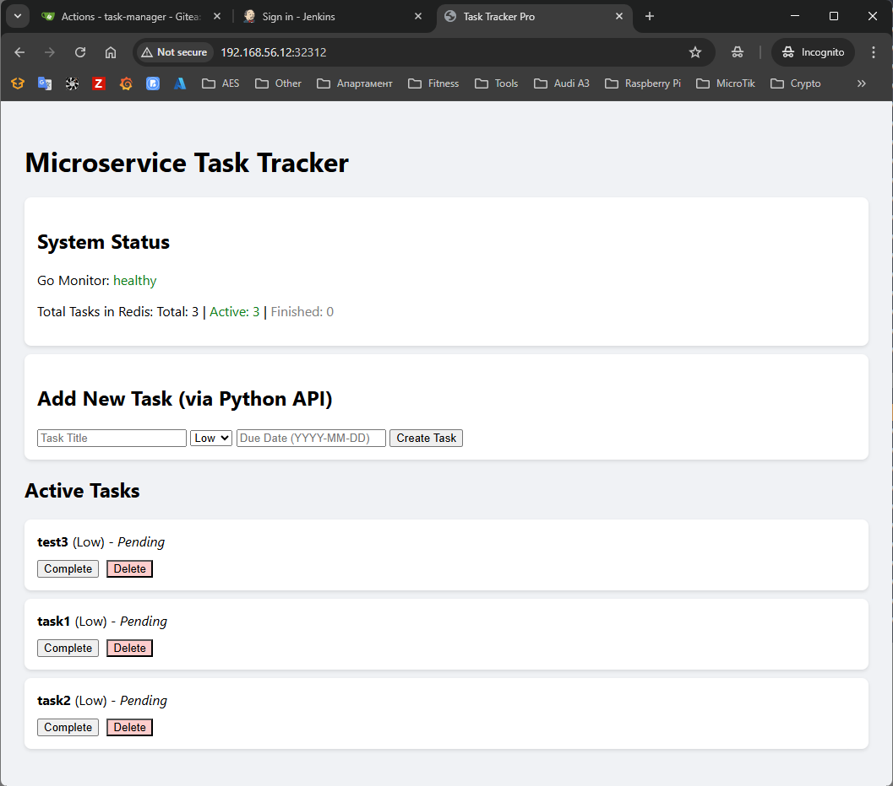
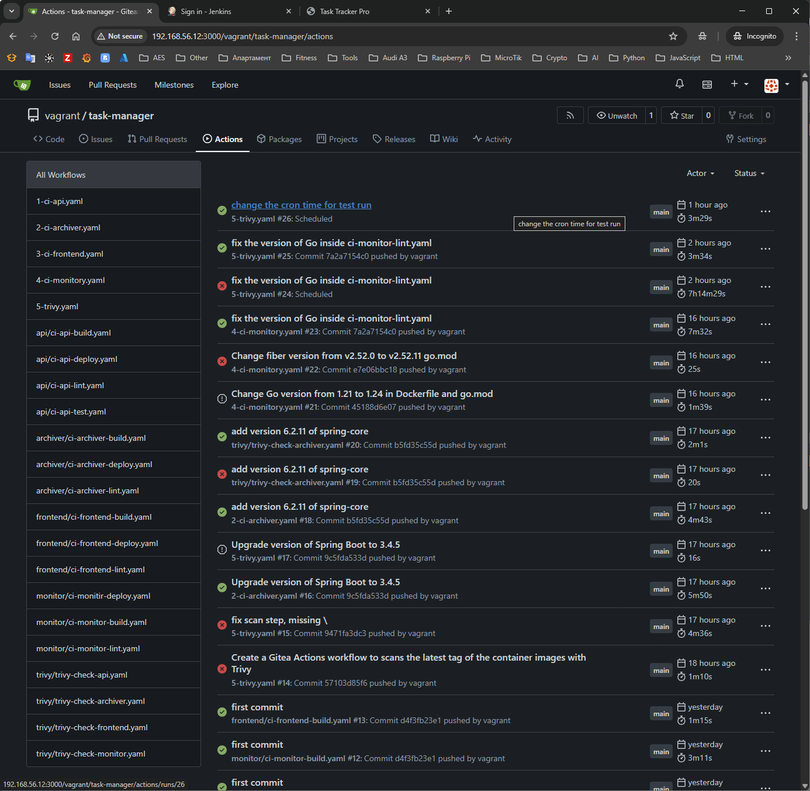

## Task

_Create a **Gitea Actions** workflow that executes **periodically**, for example, **every day at 20:00** and using **Trivy**, scans the **latest** tag of the container images of our four microservices. The workflow/pipeline should also allow manual execution._

## Solution

- **[Diagram](#diagram)**
- **[Create Trivy master workflow](#create-trivy-master-workflow)**
- **[Create a separate workflow for scan each image](#create-a-separate-workflow-for-scan-each-image)**
- **[API](#api)**
- **[Archiver](#archiver)**
- **[Monitor](#monitor)**
- **[Result](#result)**

### Diagram

```plain
------------+-------------
            |
      192.168.56.12
            |
+-----------+-----------+
|       [ docker ]      |
|                       |
|  docker               |
|  gitea                |
|  docker registry      |
|  git                  |
|  k3s                  |
|                       |
+-----------------------+
```

### Up the setup

```sh
$ kubectl apply -f manifests/secret.yaml
$ kubectl apply -R -f manifests/
```



### Create Trivy master workflow

```yaml
name: Trivy Scan

concurrency:
  group: ${{ github.workflow }}-${{ github.ref }}
on:
  push:
    branches: [main]
  workflow_dispatch:
  schedule:
    - cron: "0 22 * * *"

jobs:
  check-api:
    uses: ./.gitea/workflows/trivy/trivy-check-api.yaml

  check-archiver:
    uses: ./.gitea/workflows/trivy/trivy-check-archiver.yaml

  check-frontend:
    uses: ./.gitea/workflows/trivy/trivy-check-frontend.yaml

  check-monitor:
    uses: ./.gitea/workflows/trivy/trivy-check-monitor.yaml
```

### Create a separate workflow for scan each image

- `.gitea/workflows/trivy/trivy-check-api.yaml`

```yaml
name: Trivy API Scan

on:
  workflow_call:
  workflow_dispatch:

jobs:
  test:
    runs-on: ubuntu-latest
    steps:
      - name: Checkout code
        uses: actions/checkout@v6

      - name: Install Trivy
        run: |
          wget https://github.com/aquasecurity/trivy/releases/download/v0.69.1/trivy_0.69.1_Linux-64bit.deb
          dpkg -i trivy_0.69.1_Linux-64bit.deb
          rm trivy_0.69.1_Linux-64bit.deb

      - name: Docker image scan
        run: |
          trivy image \
            --severity HIGH,CRITICAL \
            --exit-code 1 \
            --ignorefile .trivyignore \
            192.168.56.12:5000/task-manager-api:latest
```

- `.gitea/workflows/trivy/trivy-check-archiver.yaml`

```yaml
name: Trivy Archiver Scan

on:
  workflow_call:
  workflow_dispatch:

jobs:
  test:
    runs-on: ubuntu-latest
    steps:
      - name: Checkout code
        uses: actions/checkout@v6

      - name: Install Trivy
        run: |
          wget https://github.com/aquasecurity/trivy/releases/download/v0.69.1/trivy_0.69.1_Linux-64bit.deb
          dpkg -i trivy_0.69.1_Linux-64bit.deb
          rm trivy_0.69.1_Linux-64bit.deb

      - name: Docker image scan
        run: |
          trivy image \
            --severity HIGH,CRITICAL \
            --exit-code 1 \
            --ignorefile .trivyignore \
            192.168.56.12:5000/task-manager-archiver:latest
```

- `.gitea/workflows/trivy/trivy-check-frontend.yaml`

```yaml
name: Trivy Frontend Scan

on:
  workflow_call:
  workflow_dispatch:

jobs:
  test:
    runs-on: ubuntu-latest
    steps:
      - name: Checkout code
        uses: actions/checkout@v6

      - name: Install Trivy
        run: |
          wget https://github.com/aquasecurity/trivy/releases/download/v0.69.1/trivy_0.69.1_Linux-64bit.deb
          dpkg -i trivy_0.69.1_Linux-64bit.deb
          rm trivy_0.69.1_Linux-64bit.deb

      - name: Docker image scan
        run: |
          trivy image \
            --severity HIGH,CRITICAL \
            --exit-code 1 \
            --ignorefile .trivyignore \
            192.168.56.12:5000/task-manager-frontend:latest
```

- `.gitea/workflows/trivy/trivy-check-monitor.yaml`

```yaml
name: Trivy Monitor Scan

on:
  workflow_call:
  workflow_dispatch:

jobs:
  test:
    runs-on: ubuntu-latest
    steps:
      - name: Checkout code
        uses: actions/checkout@v6

      - name: Install Trivy
        run: |
          wget https://github.com/aquasecurity/trivy/releases/download/v0.69.1/trivy_0.69.1_Linux-64bit.deb
          dpkg -i trivy_0.69.1_Linux-64bit.deb
          rm trivy_0.69.1_Linux-64bit.deb

      - name: Docker image scan
        run: |
          trivy image \
            --severity HIGH,CRITICAL \
            --exit-code 1 \
            --ignorefile .trivyignore \
            192.168.56.12:5000/task-manager-monitor:latest
```

### API

- We executing scan against the image `192.168.56.12:5000/task-manager-api:latest`

```sh
$ trivy image \
    --severity HIGH,CRITICAL \
    --exit-code 1 \
    192.168.56.12:5000/task-manager-api:latest
```

- We got 2 vulnerabilities

```plain
Report Summary

┌──────────────────────────────────────────────────────────────────────────────┬────────────┬─────────────────┬─────────┐
│                                    Target                                    │    Type    │ Vulnerabilities │ Secrets │
├──────────────────────────────────────────────────────────────────────────────┼────────────┼─────────────────┼─────────┤
│ 192.168.56.12:5000/task-manager-api:latest (debian 13.3)                     │   debian   │        2        │    -    │
├──────────────────────────────────────────────────────────────────────────────┼────────────┼─────────────────┼─────────┤
│ usr/local/lib/python3.12/site-packages/blinker-1.9.0.dist-info/METADATA      │ python-pkg │        0        │    -    │
├──────────────────────────────────────────────────────────────────────────────┼────────────┼─────────────────┼─────────┤
│ usr/local/lib/python3.12/site-packages/click-8.3.1.dist-info/METADATA        │ python-pkg │        0        │    -    │
├──────────────────────────────────────────────────────────────────────────────┼────────────┼─────────────────┼─────────┤
│ usr/local/lib/python3.12/site-packages/flask-3.1.2.dist-info/METADATA        │ python-pkg │        0        │    -    │
├──────────────────────────────────────────────────────────────────────────────┼────────────┼─────────────────┼─────────┤
│ usr/local/lib/python3.12/site-packages/itsdangerous-2.2.0.dist-info/METADATA │ python-pkg │        0        │    -    │
├──────────────────────────────────────────────────────────────────────────────┼────────────┼─────────────────┼─────────┤
│ usr/local/lib/python3.12/site-packages/jinja2-3.1.6.dist-info/METADATA       │ python-pkg │        0        │    -    │
├──────────────────────────────────────────────────────────────────────────────┼────────────┼─────────────────┼─────────┤
│ usr/local/lib/python3.12/site-packages/markupsafe-3.0.3.dist-info/METADATA   │ python-pkg │        0        │    -    │
├──────────────────────────────────────────────────────────────────────────────┼────────────┼─────────────────┼─────────┤
│ usr/local/lib/python3.12/site-packages/pip-25.0.1.dist-info/METADATA         │ python-pkg │        0        │    -    │
├──────────────────────────────────────────────────────────────────────────────┼────────────┼─────────────────┼─────────┤
│ usr/local/lib/python3.12/site-packages/redis-7.1.0.dist-info/METADATA        │ python-pkg │        0        │    -    │
├──────────────────────────────────────────────────────────────────────────────┼────────────┼─────────────────┼─────────┤
│ usr/local/lib/python3.12/site-packages/werkzeug-3.1.6.dist-info/METADATA     │ python-pkg │        0        │    -    │
└──────────────────────────────────────────────────────────────────────────────┴────────────┴─────────────────┴─────────┘
```

The problem with the base image is not fixed in the last official image. There is a option we to create a custom image for base with fixed all variabilities. We chose only to ignore it!

- Create `.trivyignore` file in the root of the project which will made Trivy to ignore `CVE-2026-0861`

```plain
# Waiting for Debian 13 patch - review by 2026-03-15
CVE-2026-0861 exp:2026-03-15
```

- After changes we made new scan with

```sh
$ trivy image \
    --severity HIGH,CRITICAL \
    --exit-code 1 \
    --ignorefile .trivyignore \
    192.168.56.12:5000/task-manager-api:latest
```

```plain
Report Summary

┌──────────────────────────────────────────────────────────────────────────────┬────────────┬─────────────────┬─────────┐
│                                    Target                                    │    Type    │ Vulnerabilities │ Secrets │
├──────────────────────────────────────────────────────────────────────────────┼────────────┼─────────────────┼─────────┤
│ 192.168.56.12:5000/task-manager-api:latest (debian 13.3)                     │   debian   │        0        │    -    │
├──────────────────────────────────────────────────────────────────────────────┼────────────┼─────────────────┼─────────┤
│ usr/local/lib/python3.12/site-packages/blinker-1.9.0.dist-info/METADATA      │ python-pkg │        0        │    -    │
├──────────────────────────────────────────────────────────────────────────────┼────────────┼─────────────────┼─────────┤
│ usr/local/lib/python3.12/site-packages/click-8.3.1.dist-info/METADATA        │ python-pkg │        0        │    -    │
├──────────────────────────────────────────────────────────────────────────────┼────────────┼─────────────────┼─────────┤
│ usr/local/lib/python3.12/site-packages/flask-3.1.2.dist-info/METADATA        │ python-pkg │        0        │    -    │
├──────────────────────────────────────────────────────────────────────────────┼────────────┼─────────────────┼─────────┤
│ usr/local/lib/python3.12/site-packages/itsdangerous-2.2.0.dist-info/METADATA │ python-pkg │        0        │    -    │
├──────────────────────────────────────────────────────────────────────────────┼────────────┼─────────────────┼─────────┤
│ usr/local/lib/python3.12/site-packages/jinja2-3.1.6.dist-info/METADATA       │ python-pkg │        0        │    -    │
├──────────────────────────────────────────────────────────────────────────────┼────────────┼─────────────────┼─────────┤
│ usr/local/lib/python3.12/site-packages/markupsafe-3.0.3.dist-info/METADATA   │ python-pkg │        0        │    -    │
├──────────────────────────────────────────────────────────────────────────────┼────────────┼─────────────────┼─────────┤
│ usr/local/lib/python3.12/site-packages/pip-25.0.1.dist-info/METADATA         │ python-pkg │        0        │    -    │
├──────────────────────────────────────────────────────────────────────────────┼────────────┼─────────────────┼─────────┤
│ usr/local/lib/python3.12/site-packages/redis-7.1.0.dist-info/METADATA        │ python-pkg │        0        │    -    │
├──────────────────────────────────────────────────────────────────────────────┼────────────┼─────────────────┼─────────┤
│ usr/local/lib/python3.12/site-packages/werkzeug-3.1.6.dist-info/METADATA     │ python-pkg │        0        │    -    │
└──────────────────────────────────────────────────────────────────────────────┴────────────┴─────────────────┴─────────┘
```

### Archiver

- We executing scan against the image `192.168.56.12:5000/task-manager-archiver:latest`

```sh
$ trivy image \
    --severity HIGH,CRITICAL \
    --exit-code 1             \
    --ignorefile .trivyignore \
    192.168.56.12:5000/task-manager-archiver:latest
```

- We got 3 HIGH variabilities

```plain
Report Summary

┌────────────────────────────────────────────────────────────────┬────────┬─────────────────┬─────────┐
│                             Target                             │  Type  │ Vulnerabilities │ Secrets │
├────────────────────────────────────────────────────────────────┼────────┼─────────────────┼─────────┤
│ 192.168.56.12:5000/task-manager-archiver:latest (ubuntu 22.04) │ ubuntu │        0        │    -    │
├────────────────────────────────────────────────────────────────┼────────┼─────────────────┼─────────┤
│ app/app.jar                                                    │  jar   │        3        │    -    │
└────────────────────────────────────────────────────────────────┴────────┴─────────────────┴─────────┘
```

- Upgrade version of Spring Boot to 3.4.5 in`pom.xml`

```xml

<!-- from -->
<parent>
    <groupId>org.springframework.boot</groupId>
    <artifactId>spring-boot-starter-parent</artifactId>
    <version>3.2.2</version>
    <relativePath/>
</parent>

<!-- to -->
<parent>
    <groupId>org.springframework.boot</groupId>
    <artifactId>spring-boot-starter-parent</artifactId>
    <version>3.4.5</version>
    <relativePath/>
</parent>
```

- Explicitly add spring-core in `pom.xml` with version 6.2.11

```xml
<properties>
    <java.version>21</java.version>
    <maven.compiler.source>21</maven.compiler.source>
    <maven.compiler.target>21</maven.compiler.target>
    <spring-framework.version>6.2.11</spring-framework.version>  <!-- add this line -->
</properties>
```

- Push the changes to rebuild the image. After changes the scan finished with 0 vulnerabilities.

```plain
Report Summary

┌────────────────────────────────────────────────────────────────┬────────┬─────────────────┬─────────┐
│                             Target                             │  Type  │ Vulnerabilities │ Secrets │
├────────────────────────────────────────────────────────────────┼────────┼─────────────────┼─────────┤
│ 192.168.56.12:5000/task-manager-archiver:latest (ubuntu 22.04) │ ubuntu │        0        │    -    │
├────────────────────────────────────────────────────────────────┼────────┼─────────────────┼─────────┤
│ app/app.jar                                                    │  jar   │        0        │    -    │
└────────────────────────────────────────────────────────────────┴────────┴─────────────────┴─────────┘
```

### Monitor

- We executing scan against image `192.168.56.12:5000/task-manager-monitor:latest`

```sh
$ trivy image \
    --severity HIGH,CRITICAL \
    --exit-code 1             \
    --ignorefile .trivyignore \
    192.168.56.12:5000/task-manager-monitor:latest
```

- We got 12 variabilities

```plain
Report Summary

┌────────────────────────────────────────────────────────────────┬──────────┬─────────────────┬─────────┐
│                             Target                             │   Type   │ Vulnerabilities │ Secrets │
├────────────────────────────────────────────────────────────────┼──────────┼─────────────────┼─────────┤
│ 192.168.56.12:5000/task-manager-monitor:latest (alpine 3.23.3) │  alpine  │        0        │    -    │
├────────────────────────────────────────────────────────────────┼──────────┼─────────────────┼─────────┤
│ root/monitor                                                   │ gobinary │       12        │    -    │
└────────────────────────────────────────────────────────────────┴──────────┴─────────────────┴─────────┘
```

- Change version of base image for build stage in Dockerfile from `golang:1.21-alpine` to `golang:1.21-alpine`

- In `go.mod` file change Go version from 1.21 to 1.24 and fiber from v2.52.0 to v2.52.11

- change the version of Go in setup step from 1.21 to 1.24 inside `ci-monitor-lint.yaml` file.

- After above fixes we got 0 vulnerabilities

```plain
Report Summary

┌────────────────────────────────────────────────────────────────┬──────────┬─────────────────┬─────────┐
│                             Target                             │   Type   │ Vulnerabilities │ Secrets │
├────────────────────────────────────────────────────────────────┼──────────┼─────────────────┼─────────┤
│ 192.168.56.12:5000/task-manager-monitor:latest (alpine 3.23.3) │  alpine  │        0        │    -    │
├────────────────────────────────────────────────────────────────┼──────────┼─────────────────┼─────────┤
│ root/monitor                                                   │ gobinary │        0        │    -    │
└────────────────────────────────────────────────────────────────┴──────────┴─────────────────┴─────────┘
```

### Result

```sh
$ kubectl get pods,svc,secrets
NAME                                READY   STATUS    RESTARTS      AGE
pod/demo-api                        1/1     Running   0             22h
pod/demo-archiver                   1/1     Running   2 (17h ago)   22h
pod/demo-db                         1/1     Running   0             22h
pod/demo-frontend-844f44d44-dqrhl   1/1     Running   0             22h
pod/demo-frontend-844f44d44-hs44x   1/1     Running   0             22h
pod/demo-frontend-844f44d44-qttzt   1/1     Running   0             22h
pod/demo-monitor                    1/1     Running   2 (16h ago)   22h

NAME                    TYPE        CLUSTER-IP      EXTERNAL-IP   PORT(S)        AGE
service/demo-api        ClusterIP   10.43.211.166   <none>        5000/TCP       22h
service/demo-db         ClusterIP   10.43.60.32     <none>        6379/TCP       22h
service/demo-frontend   NodePort    10.43.238.76    <none>        80:32312/TCP   22h
service/demo-monitor    ClusterIP   10.43.224.51    <none>        8080/TCP       22h
service/kubernetes      ClusterIP   10.43.0.1       <none>        443/TCP        23h

NAME                                TYPE                 DATA   AGE
secret/demo-secret                  Opaque               2      22h
secret/sh.helm.release.v1.demo.v1   helm.sh/release.v1   1      22h
secret/sh.helm.release.v1.demo.v2   helm.sh/release.v1   1      17h
secret/sh.helm.release.v1.demo.v3   helm.sh/release.v1   1      17h
secret/sh.helm.release.v1.demo.v4   helm.sh/release.v1   1      16h
secret/sh.helm.release.v1.demo.v5   helm.sh/release.v1   1      16h
```


