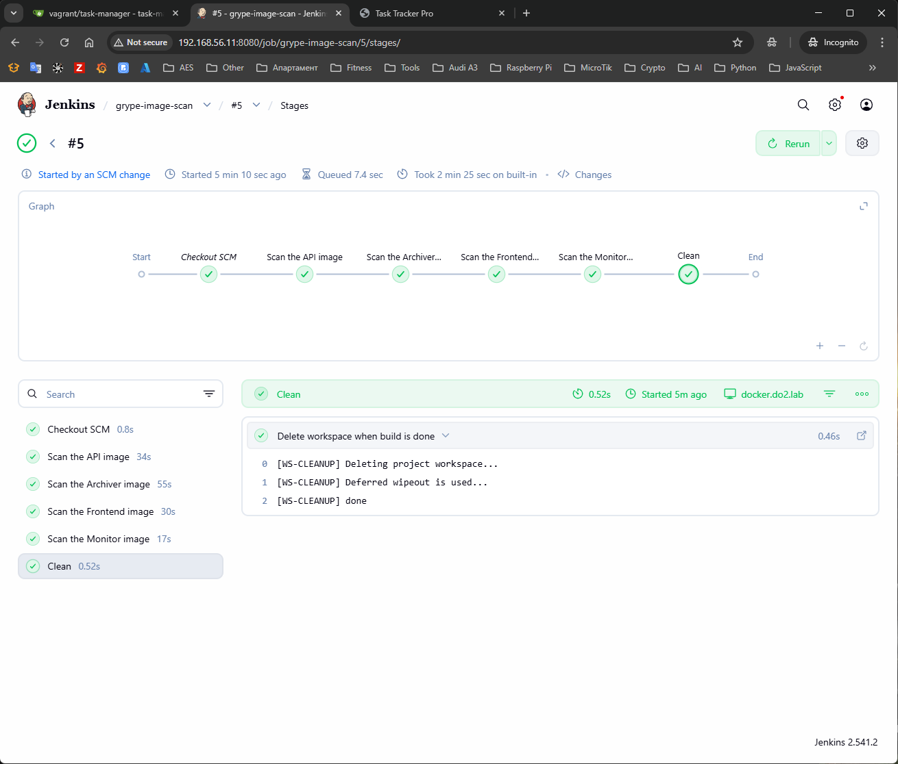

## Task

_Create a **Jenkins** pipeline that executes **periodically**, for example, **every day at 20:00** and using **Grype**, scans the **latest** tag of the container images of our four microservices. The workflow/pipeline should also allow manual execution._

## Solution

- **[Diagram](#diagram)**
- **[API](#api)**
- **[Archiver](#archiver)**
- **[Frontend](#frontend)**
- **[Monitor](#monitor)**
- **[Create Jenkins pipeline to scan all images with tag latest in 20:00 everyday](#create-jenkins-pipeline-to-scan-all-images-with-tag-latest-in-2000-everyday)**
- **[Result](#result)**

### Diagram

```plain
------------+---------------------------+------------
            |                           |
      192.168.56.12              192.168.56.11
            |                           |
+-----------+-----------+   +-----------+-----------+
|       [ docker ]      |   |      [ jenkins ]      |
|                       |   |                       |
|  docker               |   |  jenkins              |
|  gitea                |   |                       |
|  docker registry      |   |                       |
|  git                  |   |                       |
|  k8s                  |   |                       |
|                       |   |                       |
+-----------------------+   +-----------------------+
```

### API

- Check API image with Grype for vulnerabilities with severity High and Critical that can be mitigated

```sh
grype 192.168.56.12:5000/task-manager-api:latest --sort-by severity --fail-on high --ignore-states wont-fix | grep -E "High|Critical|NAME"
```

- Got 1 variability

```sh
 ✔ Loaded image                                                                                                                                         192.168.56.12:5000/task-manager-api:latest
 ✔ Parsed image                                                                                                            sha256:da213618ce0f2daea11ce7dca20fda991db09a819dd99b0934187e5bb2da2969
 ✔ Cataloged contents                                                                                                             12b1fe1b1a22c416782c636af3c68cb1187f62d77da8df525d9b5df8d4127103
   ├── ✔ Packages                        [103 packages]
   ├── ✔ File metadata                   [2,668 locations]
   ├── ✔ Executables                     [752 executables]
   └── ✔ File digests                    [2,668 files]
 ✘ Scan for vulnerabilities        [55 vulnerability matches]
   ├── by severity: 0 critical, 7 high, 27 medium, 4 low, 40 negligible
   └── by status:   15 fixed, 63 not-fixed, 23 ignored
[0015] ERROR discovered vulnerabilities at or above the severity threshold
NAME           INSTALLED                FIXED IN                    TYPE    VULNERABILITY        SEVERITY    EPSS           RISK
python         3.12.12                  *3.13.11, 3.14.1, 3.15.0    binary  CVE-2025-13836       High        0.2% (35th)    0.1
```

- Vulnerability CVE-2025-13836 is fixed in python:3.13-slim and we will update the used base image in API Dockerfile.

```yaml
# Use a lightweight Python base image
FROM python:3.13-slim # <-- change the version from 3.12-slim to 3.13-slim

# Set the working directory inside the container
WORKDIR /app

# Copy only requirements first to leverage Docker cache
COPY requirements.txt .

# Install dependencies
RUN pip install --no-cache-dir -r requirements.txt

# Copy the rest of the application code
COPY . .

# Expose the port Flask runs on
EXPOSE 5000

# Set environment variables (can be overridden by Docker Compose)
ENV REDIS_HOST=redis-db

# Run the application
CMD ["python", "app.py"]
```

### Archiver

- Scan the Archiver image

```sh
$ grype 192.168.56.12:5000/task-manager-archiver:latest --sort-by severity --fail-on high --ignore-states wont-fix | grep -E "High|Critical|NAME"
```

- Nothing founded with severity High and Critical

```sh
 ✔ Loaded image                                                                                                                                    192.168.56.12:5000/task-manager-archiver:latest
 ✔ Parsed image                                                                                                            sha256:6fbf051f00976212129d374769570832bfe942f37fd257f9b27a1afb644eab29
 ✔ Cataloged contents                                                                                                             5fc877efae3293efce927de8f2ae08616ce3ac481468aa6e003266bdf71c6213
   ├── ✔ Packages                        [185 packages]
   ├── ✔ File metadata                   [4,884 locations]
   ├── ✔ File digests                    [4,884 files]
   └── ✔ Executables                     [839 executables]
 ✔ Scanned for vulnerabilities     [82 vulnerability matches]
   ├── by severity: 0 critical, 0 high, 27 medium, 54 low, 1 negligible
   └── by status:   11 fixed, 71 not-fixed, 0 ignored
NAME                INSTALLED                     FIXED IN                TYPE          VULNERABILITY        SEVERITY    EPSS           RISK
```

### Frontend

- Scan the Frontend image

```sh
grype 192.168.56.12:5000/task-manager-frontend:latest --sort-by severity --fail-on high --ignore-states wont-fix | grep -E "High|Critical|NAME"
```

- There two vulnerabilities with severity HIGH.

```sh
 ✔ Loaded image                                                                                                                                    192.168.56.12:5000/task-manager-frontend:latest
 ✔ Parsed image                                                                                                            sha256:9b9c041801412867837ebbe2b0585ac53408008517990669a0f73c24149c8a63
 ✔ Cataloged contents                                                                                                             576b8c9e9df71be984d2bf3bb8c14f9ac9ee733dfe9de4934fc6d5b3ceced3dc
   ├── ✔ Packages                        [72 packages]
   ├── ✔ File digests                    [984 files]
   ├── ✔ File metadata                   [984 locations]
   └── ✔ Executables                     [127 executables]
 ✘ Scan for vulnerabilities        [14 vulnerability matches]
   ├── by severity: 0 critical, 2 high, 11 medium, 1 low, 0 negligible
   └── by status:   0 fixed, 14 not-fixed, 0 ignored
[0015] ERROR discovered vulnerabilities at or above the severity threshold
NAME           INSTALLED   TYPE  VULNERABILITY   SEVERITY  EPSS           RISK
tiff           4.7.1-r0    apk   CVE-2023-52356  High      0.7% (72nd)    0.5
libpng         1.6.54-r0   apk   CVE-2026-25646  High      < 0.1% (19th)  < 0.1
```

- There no fix for them to this moment and we create a `.grype.yaml` file in the root of the project to exclude this specific CVEs.

```yaml
# Vulnerabilities to ignore for the "fail-on" check
ignore:
  # Frontend
  - vulnerability: CVE-2023-52356 # tiff
  - vulnerability: CVE-2026-25646 # libpng
```

### Monitor

- Scan the Monitor image

```sh
$ grype 192.168.56.12:5000/task-manager-monitor:latest --sort-by severity --fail-on high --ignore-states wont-fix | grep -E "High|Critical|NAME"
```

- Nothing with severity High and Critical

```sh
 ✔ Pulled image
 ✔ Loaded image                                                                                                                                     192.168.56.12:5000/task-manager-monitor:latest
 ✔ Parsed image                                                                                                            sha256:f42d5dcc7f173dfb31428de2e111f6d906b73463de776235ebbc6992663b8655
 ✔ Cataloged contents                                                                                                             cba94570aeac6b5885030293b6fad4e66413becc853035e4eb484baf1df06aba
   ├── ✔ Packages                        [33 packages]
   ├── ✔ Executables                     [20 executables]
   ├── ✔ File metadata                   [233 locations]
   └── ✔ File digests                    [233 files]
 ✔ Scanned for vulnerabilities     [3 vulnerability matches]
   ├── by severity: 0 critical, 0 high, 4 medium, 0 low, 0 negligible
   └── by status:   0 fixed, 4 not-fixed, 0 ignored
NAME           INSTALLED   TYPE  VULNERABILITY   SEVERITY  EPSS           RISK
```

### Create Jenkins pipeline to scan all images with tag latest in 20:00 everyday

```Jenkinsfile
pipeline {
    agent
    {
        label 'docker'
    }
    triggers {
        cron('0 20 * * *')
    }
    environment {
        DOCKER = "192.168.56.12"
        REGISTRY_URL = "${DOCKER}:5000"
    }
    stages {
        stage('Scan the API image') {
            steps {
                sh '''
                curl -sSfL https://get.anchore.io/grype | sudo sh -s -- -b /usr/local/bin
                grype ${REGISTRY_URL}/task-manager-api:latest --sort-by severity --fail-on high --ignore-states wont-fix
				'''
            }
        }
        stage('Scan the Archiver image') {
            steps {
                sh '''
                curl -sSfL https://get.anchore.io/grype | sudo sh -s -- -b /usr/local/bin
                grype ${REGISTRY_URL}/task-manager-archiver:latest --sort-by severity --fail-on high --ignore-states wont-fix
				'''
            }
        }
        stage('Scan the Frontend image') {
            steps {
                sh '''
                curl -sSfL https://get.anchore.io/grype | sudo sh -s -- -b /usr/local/bin
                grype ${REGISTRY_URL}/task-manager-frontend:latest --sort-by severity --fail-on high --ignore-states wont-fix
				'''
            }
        }
        stage('Scan the Monitor image') {
            steps {
                sh '''
                curl -sSfL https://get.anchore.io/grype | sudo sh -s -- -b /usr/local/bin
                grype ${REGISTRY_URL}/task-manager-monitor:latest --sort-by severity --fail-on high --ignore-states wont-fix
				'''
            }
        }
        stage('Clean')
        {
            steps
            {
                cleanWs()
            }
        }
    }
}
```

- Manually execute creation of new images (in our case the only change is in API Dockerfile). Also should add `no-cache: true` in `ci-api-build.yaml` to be able to recreate latest tag for image.

### Result

- Manual trigger execution of `grype-image-scan` pipeline
  
