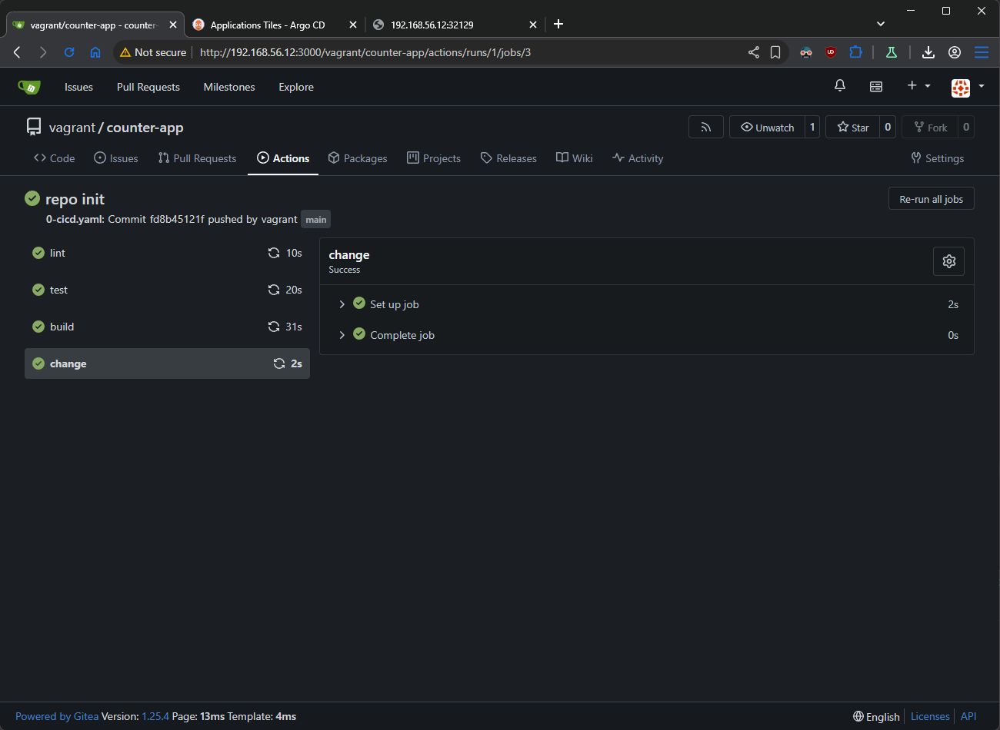
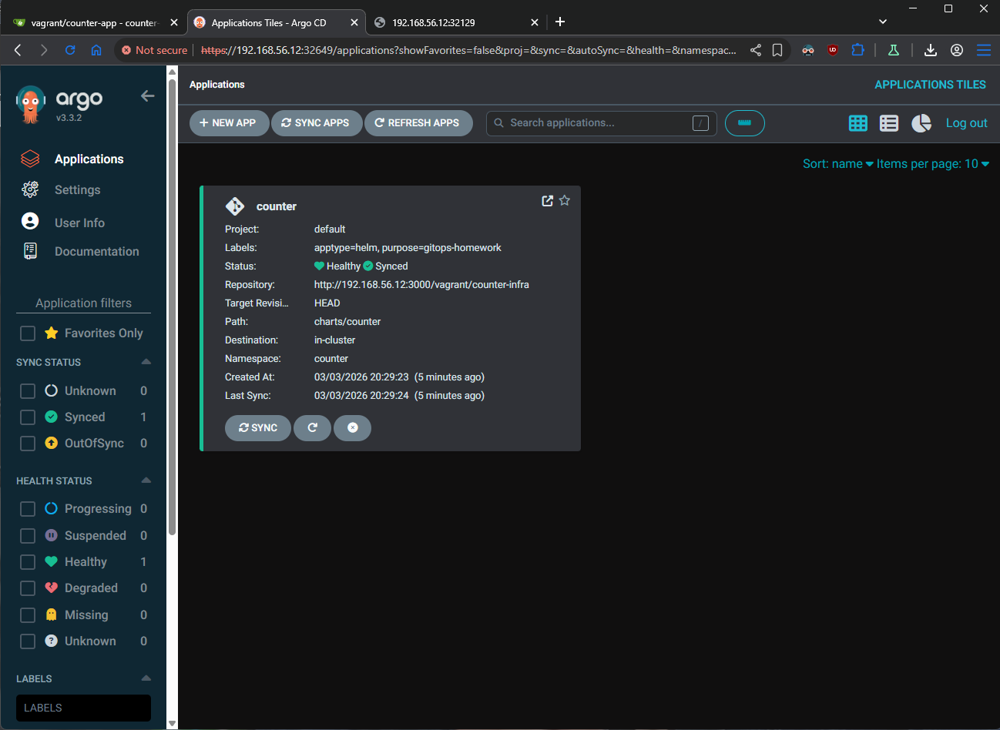
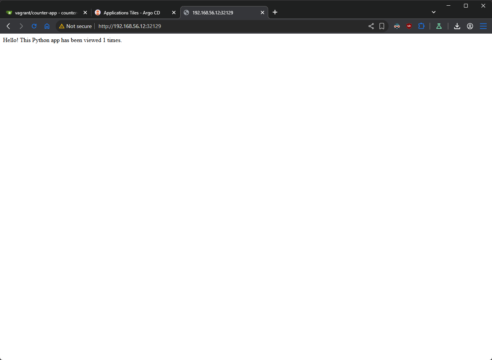
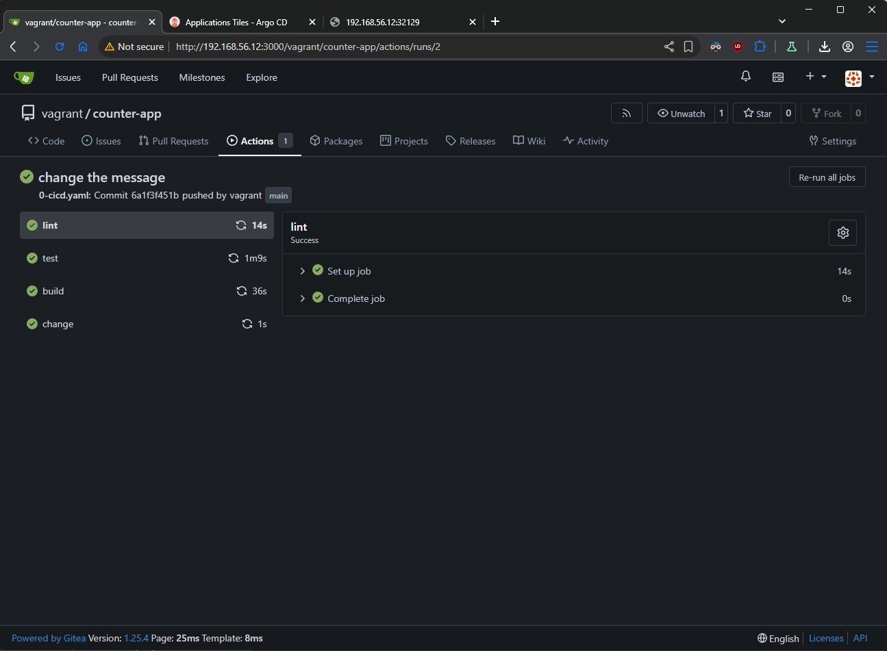
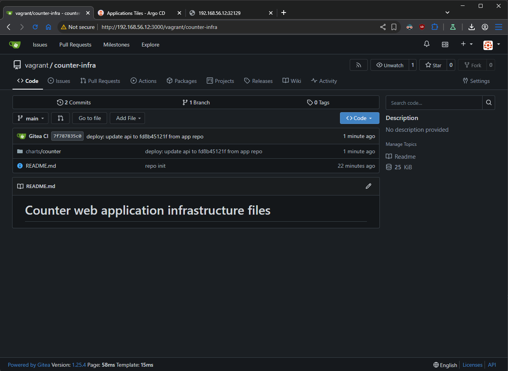
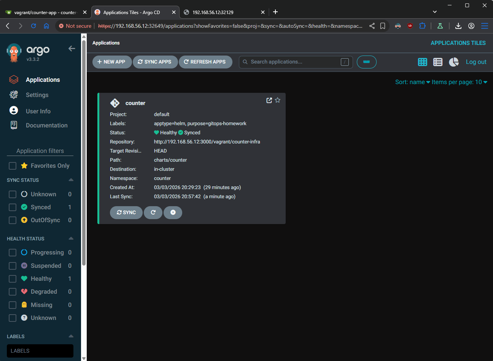
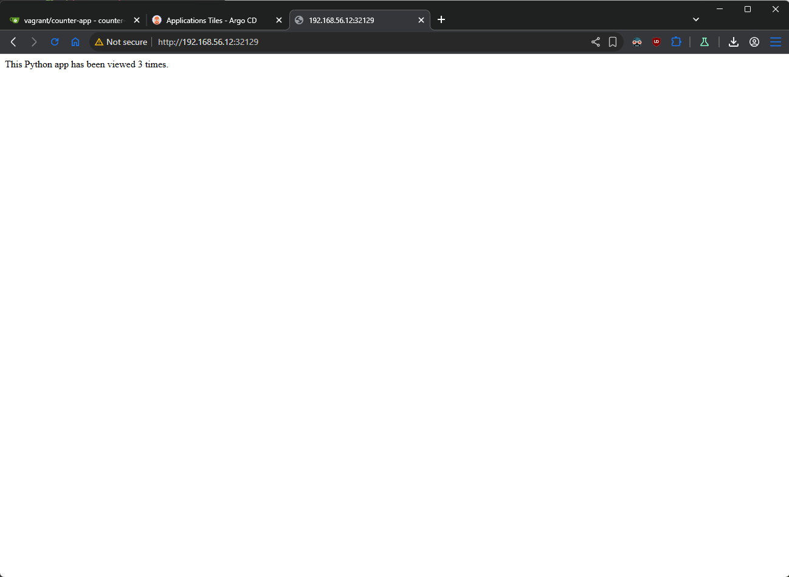
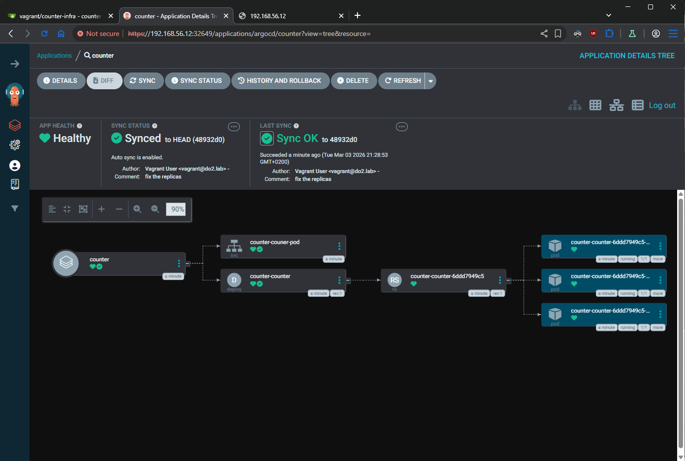

## Task

- Take the **simple counter application** (without DB dependencies) from the earlier modules (no matter the language) and create a repository for it (**counter-app**)
- Prepare a **Helm chart** for the application and store it in another repository (**counter-infra**)
- Create an end-to-end **Gitea Actions** workflow that has a **lint** (simple Dockerfile linter), **test** (simple curl-based test), **build and push**, and **change** stages
- Define **Argo CD** application that interacts with the infrastructure repository

## Solution

- **[Diagram](#diagram)**
- **[Install Argo CD](#install-argo-cd)**
- **[Create Infrastructure repository](#create-infrastructure-repository)**
- **[Create Application repository](#create-application-repository)**
- **[Create Argo CD application](#create-argo-cd-application)**
- **[Application repository change](#application-repository-change)**
- **[Infrastructure repository change](#infrastructure-repository-change)**

### Diagram

```plain
------------+-------------
            |
      192.168.56.12
            |
+-----------+-----------+
|       [ docker ]      |
|                       |
|  docker               |
|  gitea                |
|  gitea runner         |
|  docker registry      |
|  git                  |
|  k3s                  |
|  Argo CD              |
+-----------------------+
```

### Install Argo CD

- Create the namespace

```sh
kubectl create namespace argocd
```

- Install Argo CD with UI

```sh
kubectl apply -n argocd --server-side --force-conflicts -f https://raw.githubusercontent.com/argoproj/argo-cd/stable/manifests/install.yaml
```

- Patch the service to NodePort

```sh
kubectl patch svc argocd-server -n argocd -p '{"spec": {"type": "NodePort"}}'
```

- Take the NodePort for UI

```sh
kubectl get svc -n argocd
```

- Install CLI

```sh
curl -sSL -o argocd-linux-amd64 https://github.com/argoproj/argo-cd/releases/latest/download/argocd-linux-amd64

sudo install -m 555 argocd-linux-amd64 /usr/local/bin/argocd

rm argocd-linux-amd64
```

- Login

```sh
argocd login 192.168.56.12:32649
```

- Change admin password

```sh
argocd account update-password
```

### Create Infrastructure repository

- Create counter-infra with Helm chart and push to Gitea

```plain
counter-infra
├── charts
│   └── counter
│       ├── Chart.yaml
│       ├── templates
│       │   └── counter.yaml
│       └── values.yaml
└── README.md
```

- `Chart.yaml`

```yaml
apiVersion: v2
name: counter
description: A Helm chart for a Counter web application
type: application
version: 1.0.0
appVersion: "1.0.0"
```

- `values.yaml`

```yaml
global:
  registry: "192.168.56.12:5000"
counter:
  tag: "c779bebfb6"
```

- `counter.yaml`

```yaml
apiVersion: v1
kind: Pod
metadata:
  name: {{ .Release.Name }}-couner-pod
  labels:
    app: {{ .Release.Name }}-counter
    service: counter-svc
spec:
  securityContext:
    runAsUser: 1000
  containers:
  - name: counter
    image: {{ .Values.global.registry }}/counter:{{ .Values.counter.tag }}
    securityContext:
      readOnlyRootFilesystem: true
    resources:
      requests:
        memory: "128Mi"
        cpu: "250m"
      limits:
        memory: "256Mi"
        cpu: "500m"
    ports:
    - containerPort: 5000
---
apiVersion: v1
kind: Service
metadata:
  name: {{ .Release.Name }}-couner-pod
spec:
  selector:
    app: {{ .Release.Name }}-counter
    service: counter-svc
  ports:
    - protocol: TCP
      port: 5000
      targetPort: 5000
  type: NodePort
```

### Create Application repository

- Create counter-app repository, add secrets (REPO_USER, REPO_PASS), push to Gitea. This triggers CI → builds image → updates values.yaml in counter-infra → ArgoCD syncs → we have one Pod and one Service running.

```plain
counter-app
├── app.py
├── conftest.py
├── Dockerfile
├── .gitea
│   └── workflows
│       ├── 0-cicd.yaml
│       ├── 1-lint.yaml
│       ├── 2-test.yaml
│       ├── 3-build.yaml
│       └── 4-change.yaml
├── .gitignore
├── README.md
├── requirements.txt
├── test_mock.sh
└── tests
    └── test_app.py
```

- `Dockerfile`

```Dockerfile
# Use a lightweight Python base image
FROM python:3.13-slim

# Set the working directory inside the container
WORKDIR /app

# Copy only requirements first to leverage Docker cache
COPY requirements.txt .

# Install dependencies
RUN pip install --no-cache-dir -r requirements.txt

# Copy the rest of the application code
COPY . .

# Expose the port Flask runs on
EXPOSE 5000

# Run the application
CMD ["python", "app.py"]
```

- `test_app.py` - Response test via pytest library.

```python
import pytest
from app import app

@pytest.fixture
def client():
    with app.test_client() as client:
        yield client

def test_app_responce(client):
    responce = client.get('/')
    print("Responce Status:", responce.status_code)
    assert responce.status_code == 200
```

- `test_moc.sh` - Curl based test. The test can be expanded if there different endpoints, methods and payloads.

```sh
#!/bin/bash

BASE_URL="http://127.0.0.1:5000"

declare -a endpoints=(
    "/"
)

declare -a methods=(
  "GET"
)

declare -a payloads=(
  ""
)

echo "Testing all mock endpoints..."

for i in "${!endpoints[@]}"; do
    method=${methods[$i]}
    url="$BASE_URL${endpoints[$i]}"
    data=${payloads[$i]}
    echo
    echo "============= $method $url ============="
    if [[ "$method" == "GET" || "$method" == "DELETE" ]]; then
        curl -s -X $method "$url" -H "Content-Type: application/json"
    else
        curl -s -X $method "$url" -H "Content-Type: application/json" -d "$data"
    fi
    echo
done
```

- Gitea workflows (`0-cicd.yaml`, `1-lint.yaml`, `2-test.yaml`, `3-build.yaml`, `4-change.yaml`)

```yaml
# 0-cicd.yaml
name: Counter

concurrency:
  group: ${{ github.workflow }}-${{ github.ref }}
on:
  push:
    branches: [main]
    paths:
      - './**'
  workflow_dispatch:

jobs:
  lint:
    uses: ./.gitea/workflows/1-lint.yaml

  test:
    needs: lint
    uses: ./.gitea/workflows/2-test.yaml

  build:
    needs: test
    uses: ./.gitea/workflows/3-build.yaml

  change:
    needs: build
    uses: ./.gitea/workflows/4-change.yaml
    secrets: inherit

# 1-lint.yaml
name: Counter Lint

on:
  workflow_call:
  workflow_dispatch:

jobs:
  lint:
    runs-on: ubuntu-latest
    steps:
      - name: Checkout code
        uses: actions/checkout@v6

      - name: Check for secrets
        run: |
          curl -L https://github.com/gitleaks/gitleaks/releases/download/v8.30.0/gitleaks_8.30.0_linux_x64.tar.gz \
          | tar -xz --wildcards --no-anchored 'gitleaks' \
          && mv gitleaks /usr/local/bin/
          gitleaks dir . -v

      - name: Intall Hadolint
        run: |
          wget -O hadolint -q https://github.com/hadolint/hadolint/releases/download/v2.14.0/hadolint-linux-x86_64
          install -o root -g root -m 0755 hadolint /usr/local/bin/hadolint

      - name: Dockerfile linting
        run: |
          hadolint ./Dockerfile
          echo "Dockerfile is OK!"

      - name: Set up Python
        uses: actions/setup-python@v6
        with:
          python-version: '3.12'

      - name: Install dependencies
        run: pip install bandit

      - name: Python linting
        run: bandit app.py --skip B104

# 2-test.yaml
name: Counter Test

on:
  workflow_call:
  workflow_dispatch:

jobs:
  test:
    runs-on: ubuntu-latest
    steps:
      - name: Checkout code
        uses: actions/checkout@v6

      - name: Set up Python
        uses: actions/setup-python@v6
        with:
          python-version: '3.12'

      - name: Install dependencies
        run: |
          apt install python3.12-venv
          python -m venv .venv
          source .venv/bin/activate
          pip install --upgrade pip
          pip install -r requirements.txt

      - name: Run Unit Tests
        run: python3 -m pytest tests/test_app.py

      - name: Start Flask server in background
        run: |
          source .venv/bin/activate
          export PYTHONPATH=.
          nohup python app.py > flask.log 2>&1 &
          sleep 5

      - name: Run curl script
        run: |
          chmod +x test_mock.sh
          ./test_mock.sh

# 3-build.yaml
name: Counter Build

on:
  workflow_call:
  workflow_dispatch:

env:
  DOCKER_REGISTRY_URL: 192.168.56.12:5000
  DOCKER_IMAGE_NAME: counter

jobs:
  build:
    runs-on: ubuntu-latest
    steps:
      - name: Checkout Code
        uses: actions/checkout@v6

      - name: Set up Docker Buildx
        uses: docker/setup-buildx-action@v3
        with:
          buildkitd-config-inline: |
            [registry."192.168.56.12:5000"]
              http = true
              insecure = true

      - name: Extract metadata (tags, labels) for Docker
        id: meta
        uses: docker/metadata-action@v5
        with:
          images: ${{ env.DOCKER_REGISTRY_URL }}/${{ env.DOCKER_IMAGE_NAME }}
          tags: |
            type=sha,enable=true,priority=100,prefix=,suffix=,format=short
            type=raw,value=latest
        env:
          DOCKER_METADATA_SHORT_SHA_LENGTH: 10

      - name: Build and push Docker image
        id: push
        uses: docker/build-push-action@v6
        with:
          platforms: linux/amd64
          context: .
          file: ./Dockerfile
          push: true
          pull: true
          no-cache: true
          provenance: false
          sbom: true
          tags: |
            ${{ steps.meta.outputs.tags }}
          labels: ${{ steps.meta.outputs.labels }}

# 4-change.yaml
name: Counter Change

on:
  workflow_call:
  workflow_dispatch:

env:
  GITEA_URL: 192.168.56.12:3000
  REGISTRY_URL: 192.168.56.12:5000

jobs:
  change:
    runs-on: ubuntu-latest
    steps:
      - name: Update the image tag
        run: |
          # 0. Get the tag
          hash=${{ gitea.sha }}
          export COUNTER_TAG=${hash::10}

          # 1. Setup Auth and Clone Infra Repo
          git config --global user.name "Gitea CI"
          git config --global user.email "ci@gitea.local"

          git clone http://${{ secrets.REPO_USER }}:${{ secrets.REPO_PASS }}@${{ env.GITEA_URL }}/${{ secrets.REPO_USER }}/counter-infra.git
          cd counter-infra

          # 2. Update Version using yq
          yq -i ".counter.tag = \"$COUNTER_TAG\"" charts/counter/values.yaml

          # 3. Commit and Push back to Infra Repo
          git diff --quiet && echo "No changes, skipping push" && exit 0
          git add .
          git commit -m "deploy: update api to $COUNTER_TAG from app repo"
          git push origin main
```



### Create Argo CD application

- Create ArgoCD app pointing to counter-infra (with --auto-prune, --self-heal)

```sh
argocd app create counter \
    --repo http://192.168.56.12:3000/vagrant/counter-infra \
    --path charts/counter \
    --dest-namespace counter \
    --dest-server https://kubernetes.default.svc \
    --sync-policy auto \
    --auto-prune \
    --self-heal \
    --sync-option CreateNamespace=true \
    --label purpose=gitops-homework \
    --label apptype=helm
```



- The web application



### Application repository change

- Make a change in html of app.py → triggers CI workflow → new image built → values.yaml updated → ArgoCD syncs new version.

- Commit in Application repository triggers CI workflows



- The Infrastructure repository after workflow execution in Application repository



- ArgoCD syncs new version



- The web application after sync



### Infrastructure repository change

- Update counter.yaml in counter-infra repository. Change the from Pod to Deployment.

```yaml
apiVersion: apps/v1
kind: Deployment
metadata:
  name: {{ .Release.Name }}-counter
  labels:
    app: {{ .Release.Name }}-counter
    service: counter-svc
spec:
  replicas: {{ .Values.counter.replicaCount }}
  selector:
    matchLabels:
      app: {{ .Release.Name }}-counter
      service: counter-svc
  strategy:
    type: RollingUpdate
    rollingUpdate:
      maxSurge: 1
      maxUnavailable: 0
  template:
    metadata:
      labels:
        app: {{ .Release.Name }}-counter
        service: counter-svc
    spec:
      securityContext:
        runAsUser: 1000
      containers:
      - name: counter
        image: {{ .Values.global.registry }}/counter:{{ .Values.counter.tag }}
        securityContext:
          readOnlyRootFilesystem: true
        resources:
          requests:
            memory: "128Mi"
            cpu: "250m"
          limits:
            memory: "256Mi"
            cpu: "500m"
        ports:
        - containerPort: 5000
---
apiVersion: v1
kind: Service
metadata:
  name: {{ .Release.Name }}-couner-pod
spec:
  selector:
    app: {{ .Release.Name }}-counter
    service: counter-svc
  ports:
    - protocol: TCP
      port: 5000
      targetPort: 5000
  type: NodePort

```

- Update values.yaml adding **replicaCount** with value 3.

```sh
global:
  registry: "192.168.56.12:5000"
counter:
  replicaCount: 3
  tag: "6a1f3f451b"
```

- Commit and push to Infrastructure repository.
- ArgoCD detects the change, creates the Deployment, and prunes the old Pod automatically thanks to **--auto-prune**.


