## Task

- Add a new metric to the **API** service, called **tasks_completed_total** of type counter
- Add a new metric to the **API** service, called **tasks_active** of type gauge
- Create a simple **Grafana** dashboard to display the three **API** metrics -- **tasks_created_total** (created during the session), **tasks_completed_total**, and **tasks_active**

## Solution

- **[Diagrama](#diagram)**
- **[Install Prometheus and Grafana](#install-prometheus-and-grafana)**
- **[Implement metrics endpoint to API service (Task Manager)](#implement-metrics-endpoint-to-api-service-task-manager)**
- **[Install Bitnami Sealed Secrets into our Kubernetes cluster](#install-bitnami-sealed-secrets-into-our-kubernetes-cluster)**
- **[Craete a ServiceMonitor object](#craete-a-servicemonitor-object)**
- **[Create Application](#create-application)**
- **[Create Grafana dashboard](#create-grafana-dashboard)**

---

### Diagram

```plain
------------+-------------
            |
      192.168.56.12
            |
+-----------+-----------+
|       [ docker ]      |
|                       |
|  docker               |
|  gitea                |
|  gitea runner         |
|  docker registry      |
|  git                  |
|  k3s                  |
|  Argo CD              |
|  Prometheus           |
|  Grafana              |
+-----------------------+
```
---
### Install Prometheus and Grafana
- Add repository to Helm
```sh
helm repo add prometheus-community https://prometheus-community.github.io/helm-charts
```
- Update information for registerd repositories
```sh
helm repo update
```
- Create file with values `prom-values.yaml`
```yaml
prometheus:
  enabled: true
  service:
    type: NodePort
grafana:
  enabled: true
  adminPassword: admin
  service:
    type: NodePort
alertmanager:
  enabled: false
```
- Install the Stack (Prometheus + Grafana + Node Exporters)
```sh
helm upgrade --install monitoring prometheus-community/kube-prometheus-stack \
    --namespace monitoring \
    --create-namespace \
    -f prom-values.yaml
```
---
### Implement metrics endpoint to API service (Task Manager)
- Clone application repository
```sh
git clone http://192.168.56.12:3000/vagrant/task-manager-app.git
```
- Add two new imports in `~/task-manager-app/services/api/app.py`
```python
from prometheus_client import Counter, Histogram, generate_latest, CONTENT_TYPE_LATEST
import time
```
- Add the following metrics block after appliocation initialization `app = Flask(__name__)`
```python
# --- PROMETHEUS METRICS DEFINITION ---
# Counter for total requests (Labels help us differentiate between endpoints/methods)
REQUEST_COUNT = Counter(
    'http_requests_total', 'Total HTTP Requests', 
    ['method', 'endpoint', 'http_status']
)

# Histogram for request duration (latency)
REQUEST_LATENCY = Histogram(
    'http_request_duration_seconds', 'HTTP request latency',
    ['method', 'endpoint']
)

# Custom Business Metric: Total tasks created
TASKS_CREATED = Counter('tasks_created_total', 'Total number of tasks created')

# Custom Business Metric: Total completed tasks
TASKS_COMPLETED = Counter('tasks_completed_total', 'Total number of tasks completed')

# Custom Business Metric: Return active tasks
TASKS_ACTIVE = Gauge('tasks_active', 'Current active tasks')
# -------------------------------------
```
- Add two new methods to able to calculate the latency of request for Prometheus histogram `REQUEST_LATENCY`
```python
@app.before_request
def start_timer():
    request.start_time = time.time()

@app.after_request
def record_metrics(response):
    # Calculate latency
    latency = time.time() - request.start_time
    # Record metrics
    REQUEST_COUNT.labels(
        method=request.method, 
        endpoint=request.path, 
        http_status=response.status_code
    ).inc()
    REQUEST_LATENCY.labels(
        method=request.method, 
        endpoint=request.path
    ).observe(latency)
    return response

```
- Create custom function to take the actual value of active tasks. Add function near `validate_task()` function.
```python
def sync_active_tasks():
    """ Update active tasks """
    keys = db.keys("task:*")
    tasks = [json.loads(db.get(k)) for k in keys]
    active = [t for t in tasks if t.get("status") == "Pending"]
    TASKS_ACTIVE.set(len(active))
```
- Add the new `metrics()` route.
```python
@app.route('/metrics')
def metrics():
    """Endpoint for Prometheus to scrape"""
    return generate_latest(), 200, {'Content-Type': CONTENT_TYPE_LATEST}
```
- Modify `create_task()` route adding just before **return** clause the following
```python
# Increment our business metric
sync_active_tasks()
TASKS_CREATED.inc()
```
- Modify `complete_task()` route adding just before **return** clause the following
```python
# Increment our business metric
sync_active_tasks()
TASKS_COMPLETED.inc()
```

- Modify `delete_task()` route adding just before **return** clause the following
```sh
# Increment our business metric
sync_active_tasks()
```
- Add the following to the `requirements.txt` file
```txt
prometheus-client
```
- Push the changes to Gitea.
- Build manually all images in Gitea.

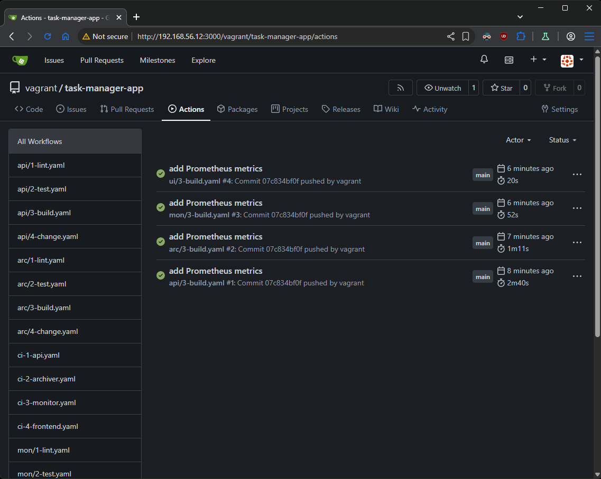

---
### Install Bitnami Sealed Secrets into our Kubernetes cluster
- Add the Sealed Secrets repository
```sh
helm repo add sealed-secrets https://bitnami-labs.github.io/sealed-secrets
```
- Install the controller
```sh
helm install sealed-secrets-controller sealed-secrets/sealed-secrets -n kube-system
```
- Install the CLI tool
```sh
# Fetch the latest sealed-secrets version using GitHub API
KUBESEAL_VERSION=$(curl -s https://api.github.com/repos/bitnami-labs/sealed-secrets/tags | jq -r '.[0].name' | cut -c 2-)

# Download the CLI archive
curl -OL "https://github.com/bitnami-labs/sealed-secrets/releases/download/v${KUBESEAL_VERSION}/kubeseal-${KUBESEAL_VERSION}-linux-amd64.tar.gz"

# Extract the binary
tar -xvzf kubeseal-${KUBESEAL_VERSION}-linux-amd64.tar.gz kubeseal

# install it
sudo install -m 755 kubeseal /usr/local/bin/kubeseal

# clean and check 
rm kubeseal* && kubeseal --version
```
- Clone the Infrastructure repository
```sh
git clone http://192.168.56.12:3000/vagrant/task-manager-infra.git
```
- Seal the **Kubernetes** secret manifest first
```sh
kubeseal --format yaml --scope cluster-wide < /vagrant/apps/task-manager-infra/manifests/secret.yaml > ~/task-manager-infra/manifests/sealed-secret.yaml
```
- Remove the encrypted secrets value file `secrets.enc.yaml`
```sh
rm ~/task-manager-infra/charts/task-manager/secrets.enc.yaml
```
- Make sure that `~/task-manager-infra/charts/task-manager/templates/secret.yaml` looks like this
```yaml
apiVersion: bitnami.com/v1alpha1
kind: SealedSecret
metadata:
  annotations:
    sealedsecrets.bitnami.com/cluster-wide: "true"
  name: {{ .Release.Name }}-secret
spec:
  encryptedData:
    CLI_PASSWORD: {{ .Values.secrets.cli_password }}
    SRV_PASSWORD: {{ .Values.secrets.srv_password }}
   
  template:
    metadata:
      annotations:
        sealedsecrets.bitnami.com/cluster-wide: "true"
      name: {{ .Release.Name }}-secret
    type: Opaque
```
- Copy the encrypted values from `~/task-manager-infra/manifests/sealed-secret.yaml` to the `~/task-manager-infra/charts/task-manager/values.yaml`
```yaml
secrets:
  cli_password: # replace with encrypted value from kubeseal
  srv_password: # replace with encrypted value from kubeseal
```

---
### Craete a ServiceMonitor object
- Add `~/task-manager-infra/charts/task-manager/templates/api-monitor.yaml` with the following content
```yaml
apiVersion: monitoring.coreos.com/v1
kind: ServiceMonitor
metadata:
  name: {{ .Release.Name }}-api-monitor
  labels:
    release: monitoring
spec:
  selector:
    matchLabels:
      service: api
  endpoints:
  - targetPort: 5000
    path: /metrics
```
- Adjust the `~/task-manager-infra/charts/task-manager/templates/api.yaml` file by adding the **label** section to the **API** service metadata.
```yaml
  labels:
    service: api
```
- Push the changes to Gitea.
---
### Install Argo CD
- Create the namespace
```sh
kubectl create namespace argocd
```
- Install it with UI
```sh
kubectl apply -n argocd --server-side --force-conflicts -f https://raw.githubusercontent.com/argoproj/argo-cd/stable/manifests/install.yaml
```
- Patch tje service to **NodePort**
```sh
kubectl patch svc argocd-server -n argocd -p '{"spec": {"type": "NodePort"}}'
```
- Get the service port
```sh
$ kubectl get svc -n argocd
NAME                                      TYPE        CLUSTER-IP      EXTERNAL-IP   PORT(S)                      AGE
argocd-applicationset-controller          ClusterIP   10.43.86.66     <none>        7000/TCP,8080/TCP            25s
argocd-dex-server                         ClusterIP   10.43.17.46     <none>        5556/TCP,5557/TCP,5558/TCP   24s
argocd-metrics                            ClusterIP   10.43.95.59     <none>        8082/TCP                     24s
argocd-notifications-controller-metrics   ClusterIP   10.43.18.57     <none>        9001/TCP                     24s
argocd-redis                              ClusterIP   10.43.9.147     <none>        6379/TCP                     24s
argocd-repo-server                        ClusterIP   10.43.21.146    <none>        8081/TCP,8084/TCP            24s
argocd-server                             NodePort    10.43.222.182   <none>        80:31897/TCP,443:31446/TCP   24s
argocd-server-metrics                     ClusterIP   10.43.19.242    <none>        8083/TCP                     24s
```
- Open browser on **http://192.168.56.12:\<node-port\>**
- CLI Install
```sh
# take latest stable version
VERSION=$(curl -L -s https://raw.githubusercontent.com/argoproj/argo-cd/stable/VERSION)

# download
curl -sSL -o argocd-linux-amd64 https://github.com/argoproj/argo-cd/releases/download/v$VERSION/argocd-linux-amd64

# install
sudo install -m 555 argocd-linux-amd64 /usr/local/bin/argocd

# clean and check
rm argocd-linux-amd64 && argocd version

# add command completion (for bash)
. <(argocd completion bash)
```
- Set admin creadentials
```sh
# get initial admin password
argocd admin initial-password -n argocd

# login Argo CD cli
argocd login 192.168.56.12:NODE-PORT

# change the password
argocd account update-password
```

---
### Create Application
```sh
argocd app create task-manager \
	--repo http://192.168.56.12:3000/vagrant/task-manager-infra \
	--path charts/task-manager \
	--dest-server https://kubernetes.default.svc \
	--dest-namespace tm \
	--sync-policy automated \
	--self-heal \
	--sync-option CreateNamespace=true \
	--label purpose=module-7 \
	--label apptype=yaml
```
- Check the application in **Kubernetes**
```sh
$ kubectl get -n tm pods,deployments,svc,secrets,sealedsecrets,servicemonitor
NAME                                         READY   STATUS    RESTARTS   AGE
pod/task-manager-api                         1/1     Running   0          13s
pod/task-manager-archiver                    1/1     Running   0          13s
pod/task-manager-db                          1/1     Running   0          13s
pod/task-manager-frontend-68b4cff576-825fz   1/1     Running   0          13s
pod/task-manager-frontend-68b4cff576-jqh2j   1/1     Running   0          13s
pod/task-manager-frontend-68b4cff576-swbdc   1/1     Running   0          13s
pod/task-manager-monitor                     1/1     Running   0          13s

NAME                                    READY   UP-TO-DATE   AVAILABLE   AGE
deployment.apps/task-manager-frontend   3/3     3            3           13s

NAME                            TYPE        CLUSTER-IP      EXTERNAL-IP   PORT(S)        AGE
service/task-manager-api        ClusterIP   10.43.18.115    <none>        5000/TCP       13s
service/task-manager-db         ClusterIP   10.43.238.100   <none>        6379/TCP       13s
service/task-manager-frontend   NodePort    10.43.209.166   <none>        80:32107/TCP   13s
service/task-manager-monitor    ClusterIP   10.43.140.91    <none>        8080/TCP       13s

NAME                         TYPE     DATA   AGE
secret/task-manager-secret   Opaque   2      12s

NAME                                           STATUS   SYNCED   AGE
sealedsecret.bitnami.com/task-manager-secret            True     13s

NAME                                                            AGE
servicemonitor.monitoring.coreos.com/task-manager-api-monitor   13s
```

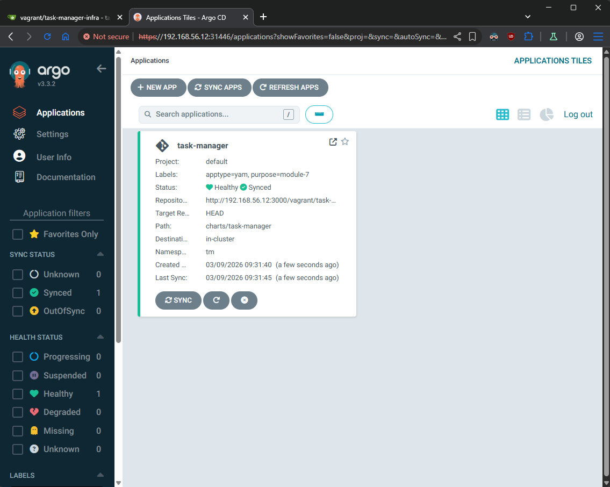

- Create two test tasks in our application

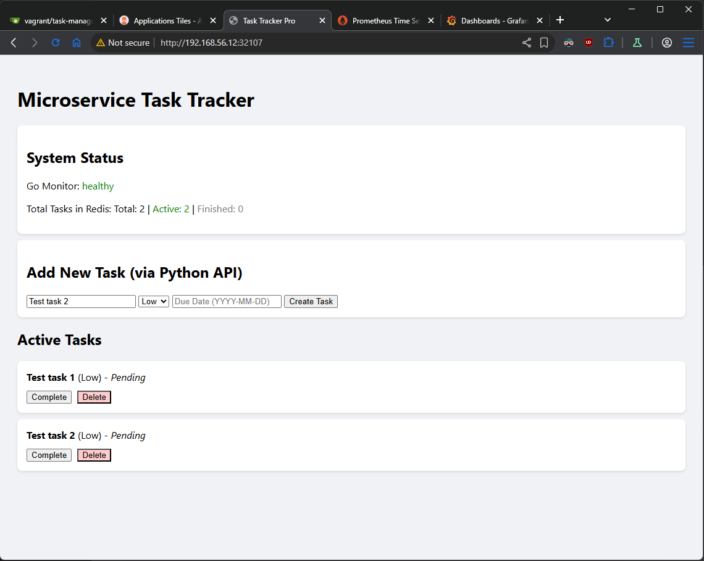

- Check the metrics in Prometheus
```sh
# take the NodePort of Prometheus and Grafana
kubectl -n monitoring get svc
```

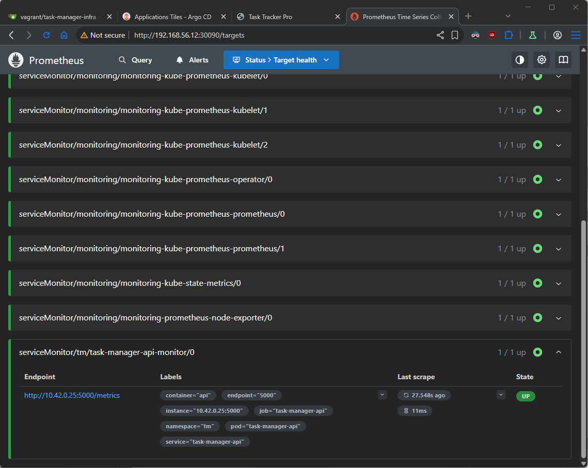

- Check if out metric for **active** taks showing right value.

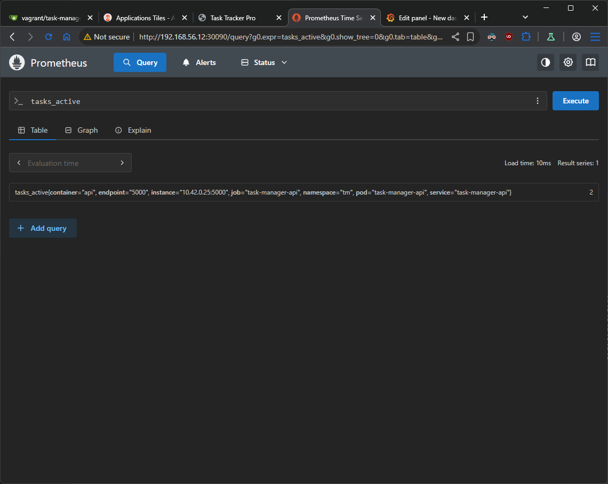

---
### Create Grafana dashboard
- Login Grafana (default: admin/admin)
- Create new dashboard
Dashboards -> New -> New dashboard -> + Add visualization -> Select Prometheus

- Crate Stat for `tasks_created_total` metric

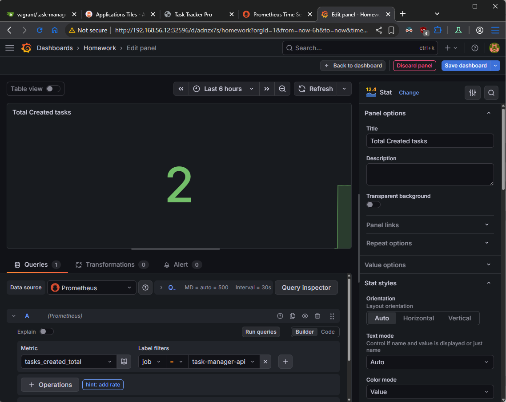

- Create a Stat for `tasks_completed_total` metric

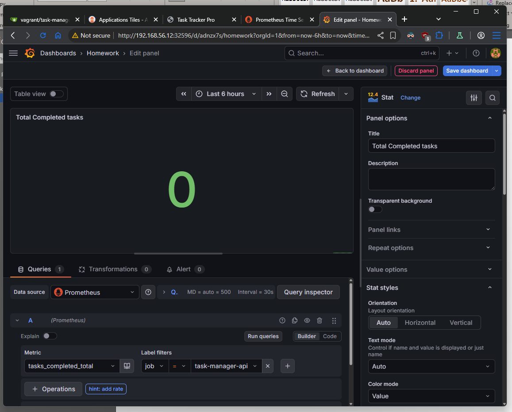

- Create a Gauge for `tasks_active` metric

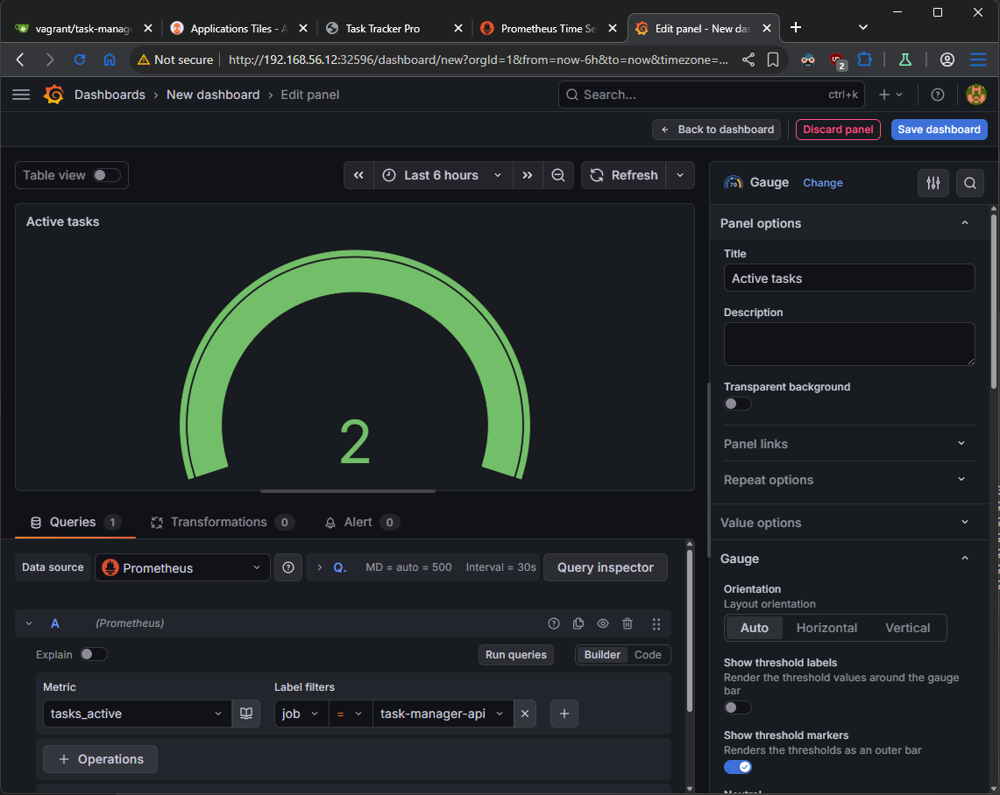

- Dashboard

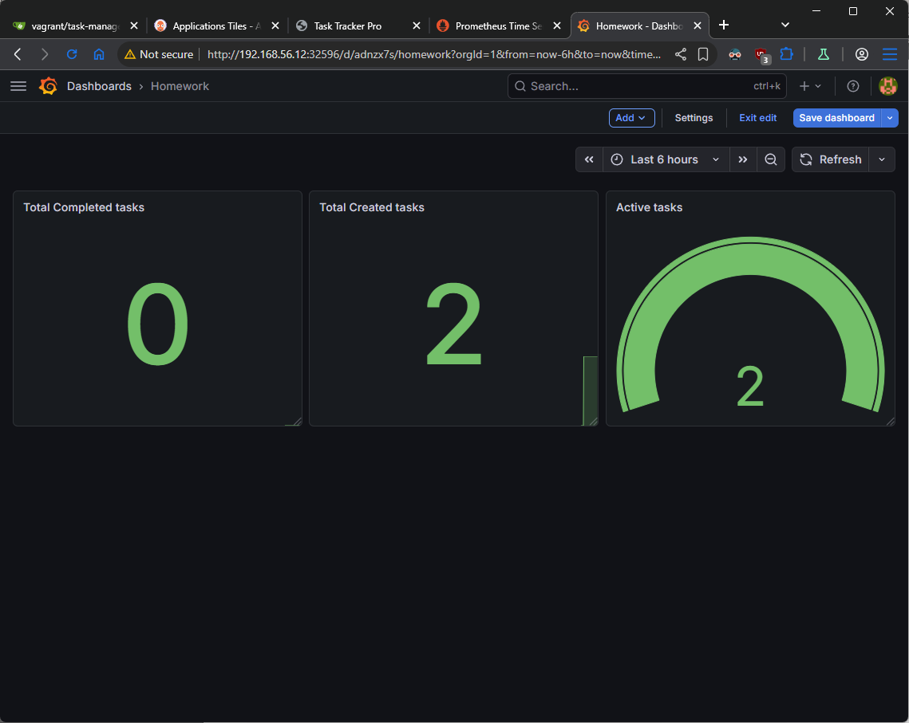

- Complete first two test tasks and create one new

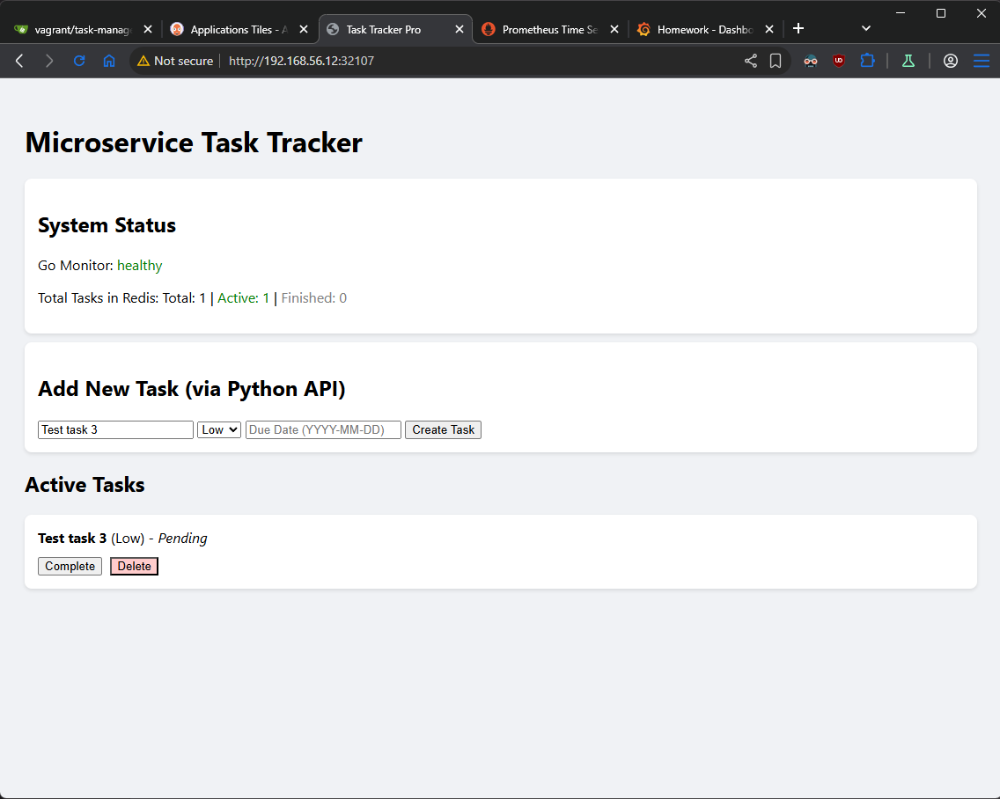

- Check dashboard

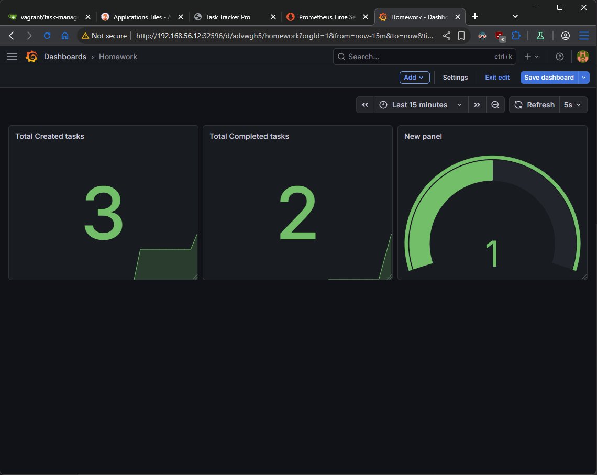