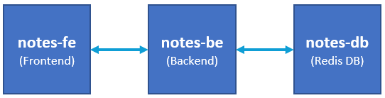
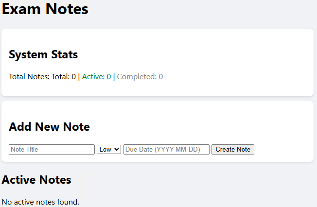

# Exam Notes

Included microservices/components:
- **backend** - written in Python
- **frontend** - written in HTML and JavaScript

There is one external dependency - Redis is required

Here is a general overview of the components:



The **backend** component exposes **Prometheus** metrics at `/metrics`

To build each component, you can use:

```bash
# For the backend
cd ~/exam-notes/services/backend
docker build -t notes-be .

# For the frontend
cd ~/exam-notes/services/frontend
docker build -t notes-fe .
```

You could start the application with the following set of commands:

```bash
# Create a network
docker network create notes-app

# Start the Redis DB
docker container run -d --name notes-db -p 6379:6379 --net notes-app redis

# Start the backend component
docker container run -d --name notes-be -p 10001:5000 -e REDIS_HOST=notes-db --net notes-app notes-be

# Start the frontend component
docker container run -d --name notes-fe -p 10002:80 --net notes-app notes-fe
```

And here is what you will see if you run the application successfuly:


